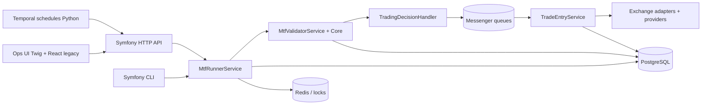

# Architecture Systeme

TradingV3 est une plateforme de trading futures orientee Bitmart, avec une architecture preparee pour plusieurs exchanges.

## Vue logique

## Runtime

| Couche | Role |
| --- | --- |
| HTTP/CLI | Recoit une demande de run MTF ou une commande d'exploitation. |
| Runner | Resout les symboles, synchronise l'etat exchange, filtre les positions/ordres, lance la validation. |
| Validator | Charge le profil YAML, construit les contextes indicateurs, valide contexte et execution. |
| Decision | Convertit un symbole `READY` en message de decision ou en appel TradeEntry. |
| TradeEntry | Calcule entry zone, sizing, levier, SL/TP, place les ordres et attache les protections. |
| Provider/Exchange | Normalise l'acces Bitmart, OKX, Hyperliquid et Fake exchange. |
| Messenger | Decouple projection, decision et surveillance des ordres. |
| Temporal | Planifie les appels periodiques a l'API Symfony. |

## Services Docker

Le `docker-compose.yml` racine assemble:

- Temporal server, Temporal UI et PostgreSQL Temporal;
- `cron-symfony-mtf-workers` pour les schedules;
- les services Symfony/DB/Redis/Nginx definis dans la stack applicative;
- des blocs monitoring commentes, non actifs par defaut.

Le dossier `trading-app/compose.yaml` contient une configuration Symfony standard reduite. La configuration operationnelle principale reste le compose racine.

## Surfaces utilisateur

| Surface | Emplacement | Statut |
| --- | --- | --- |
| Ops Twig | `trading-app/src/Front`, `trading-app/templates/front` | Interface recente pour cockpit, risk, decisions, investigations, systeme et Temporal. |
| Web Symfony historique | `trading-app/templates/*` | Ecrans admin MTF, provider, indicators, signals, reporting. |
| React legacy | `frontend/src` | Dashboard d'administration historique, encore documente car le code existe. |

## Principes de maintenance

- Le code runtime ne doit pas dependre du site documentaire.
- Les pages Markdown doivent pointer vers les composants reels, pas vers d'anciens noms de services.
- Les graphes doivent partir des entrypoints executables: route, commande CLI, message ou schedule.
- Les documents d'incident datés ne restent que si leur contenu est toujours applicable.
