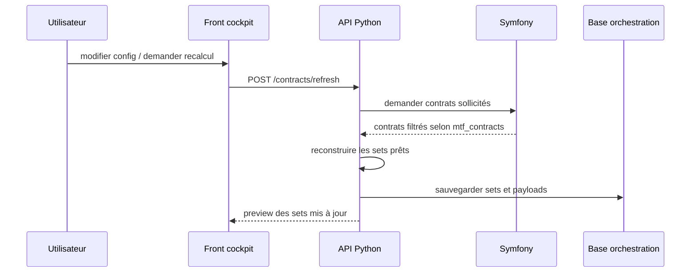
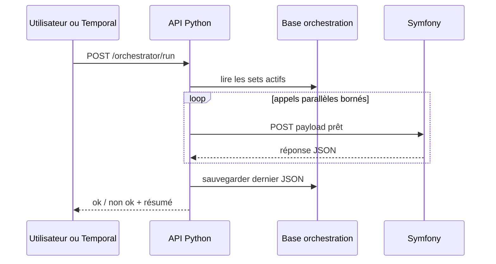

# Cockpit d'orchestration

## Objectif

Le cockpit d'orchestration permet de paramétrer les sets d'appels que l'API Python exécutera.

Il ne remplace pas Symfony. Il prépare et pilote les appels vers Symfony.

## Principe fonctionnel

```text
Front cockpit
→ configure les sets
→ force une mise à jour des contrats si nécessaire
→ déclenche un run
→ visualise le dernier résultat JSON
```

Les sets sont déjà prêts au moment du run. L'API Python ne recalcule pas les contrats à chaque déclenchement.

## Écrans attendus

### 1. Liste des dashboards

Affiche les configurations disponibles :

| Champ | Description |
| --- | --- |
| Nom | Nom fonctionnel du dashboard. |
| Statut | Actif ou inactif. |
| Nombre de sets | Nombre de sets configurés. |
| Dernier run | Date et statut du dernier run. |
| Dernier résultat | OK, non OK, partiel. |

### 2. Détail d'un dashboard

Affiche les sets configurés.

| Champ | Description |
| --- | --- |
| Enabled | Set actif ou non. |
| Set ID | Identifiant stable. |
| Action | `mtf_run`, `sync_contracts`, reporting ou autre action future. |
| Exchange | Bitmart, OKX, Hyperliquid, Fake. |
| Market type | `perpetual`, `spot`. |
| Profil | `regular`, `scalper`, `scalper_micro`. |
| Environment | `demo`, `testnet`, `mainnet`. |
| Dry-run | Simulation ou exécution réelle. |
| Workers Symfony | Gardé à `1` au début. |
| Contrats | Liste ou nombre de contrats. |
| Priorité | Ordre ou priorité fonctionnelle. |

### 3. Preview du plan d'exécution

Avant un lancement manuel, le front doit afficher ce qui va être exécuté :

```text
Run preview
- 6 sets actifs
- 6 appels Symfony prévus
- workers Symfony = 1
- concurrence globale = 2
- OKX = dry-run uniquement
- Hyperliquid = dry-run uniquement
- Bitmart live = attention / confirmation
```

Le but est d'éviter un lancement opaque.

### 4. Dernier run

Affiche le dernier résultat global retourné par l'API Python.

| Champ | Description |
| --- | --- |
| Run ID | Identifiant du run. |
| Statut | `success`, `partial_failure`, `failed`. |
| Started at | Date de début. |
| Finished at | Date de fin. |
| Total calls | Nombre d'appels Symfony lancés. |
| Success | Appels réussis. |
| Failed | Appels échoués. |
| Last JSON | Réponse complète du dernier run. |

### 5. Détail par set

Pour chaque set :

| Champ | Description |
| --- | --- |
| Set ID | Identifiant du set. |
| Payload envoyé | JSON envoyé à Symfony. |
| Réponse Symfony | JSON retourné par Symfony. |
| Statut | OK ou non OK. |
| Erreur | Message d'erreur si échec. |
| Durée | Durée de l'appel. |

## Mise à jour des contrats

La mise à jour des contrats est une action explicite.



Cette action est distincte du run.

## Déclenchement d'un run



## Règles de sécurité fonctionnelle

Le front aide l'utilisateur, mais l'API Python doit revérifier toutes les règles.

Règles minimales :

- OKX live interdit ;
- Hyperliquid live interdit ;
- confirmation obligatoire pour Bitmart live ;
- pas de même symbole live exécuté deux fois en parallèle ;
- `workers` Symfony à `1` au début ;
- concurrence globale bornée ;
- nombre de contrats borné par set ;
- dry-run visible clairement ;
- dernier JSON conservé.

## Ce que le cockpit ne doit pas faire

Le cockpit ne doit pas :

- modifier directement les stratégies YAML ;
- desserrer les EntryZones ;
- augmenter le levier ;
- activer OKX live ;
- activer Hyperliquid live ;
- masquer les erreurs ;
- transformer la parallélisation en objectif de fréquence de trades.

## Mesure fonctionnelle

Les runs doivent ensuite pouvoir être rapprochés de :

- `position_trade_analysis` ;
- PnL net ;
- MFE / MAE ;
- durée de trade ;
- frais / spread / slippage ;
- erreurs d'exécution ;
- trades évités ou bloqués.

L'objectif reste la qualité des setups et l'expectancy nette, pas le nombre brut d'appels ou de trades.

### Rapprochement run → trades (OBS-003)

Le rapprochement run → trades est exposé en lecture seule par
`GET /runs/{run_id}/outcome` (orchestrateur) qui interroge Symfony
(`GET /api/positions/analysis`). Pour un run donné, on obtient les trades produits,
leur **set / profil / exchange** d'origine, le **mode de rapprochement** entrée ↔
clôture, le PnL **enregistré** et — quand tous les coûts sont disponibles — le PnL
**net**, plus la ventilation par set / profil / exchange / symbole.

Trois garanties de fiabilité, alignées sur « moins de mauvais trades → données
fiables » :

- **Attribution certaine** : chaque trade est relié au run par un identifiant de
  corrélation déterministe (jamais une troncature qui pourrait confondre deux runs),
  et porte son `set_id` / `dashboard_id` / `exchange` / `profil`.
- **Rapprochement honnête** : l'entrée est appariée à sa clôture par identifiants
  exacts (`trade_id` puis `position_id`), jamais « la première clôture du même
  symbole ». Un trade non rapprochable reste visible (`unmatched`), pas masqué.
- **PnL jamais maquillé** : la valeur enregistrée (`recorded_pnl_usdt`) n'est jamais
  présentée comme « nette ». Seule une **estimation** best-effort
  (`estimated_net_pnl_usdt`) est exposée, accompagnée de `cost_completeness` ; le PnL net
  **certifié** est réservé au contrat de coûts complet (issue #190, non livré ici) et
  n'est donc jamais affiché. Une source indisponible est signalée explicitement (jamais
  affichée comme « 0 trade »).
- **États distincts** : `matched_closed` (clôturé+rapproché), `unmatched` (état réel
  inconnu — jamais compté comme position ouverte confirmée), `confirmed_open` et
  `unknown_state` ; le winrate ne porte que sur les trades clôturés rapprochés avec PnL.
