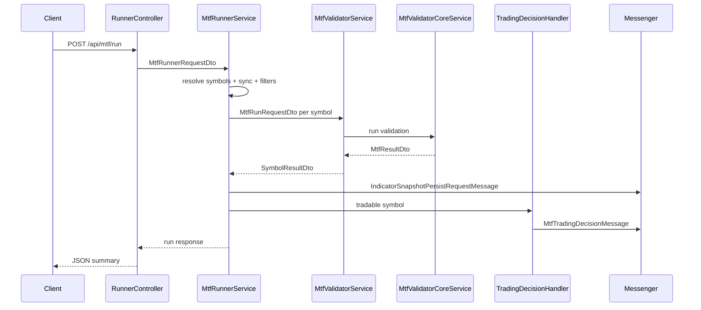
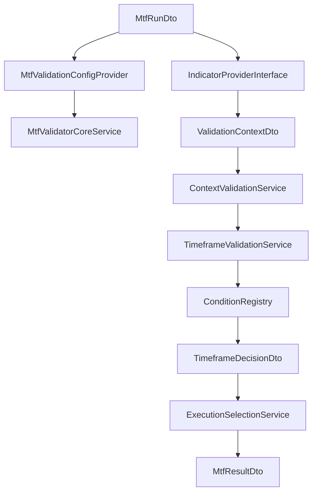
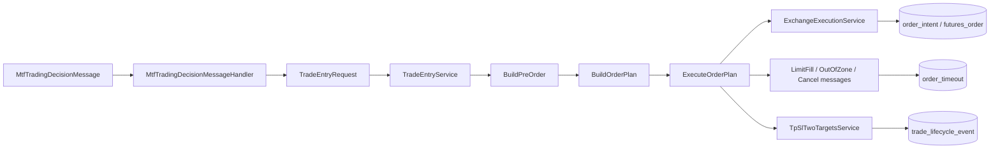
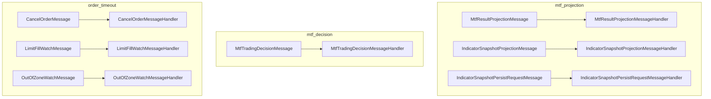
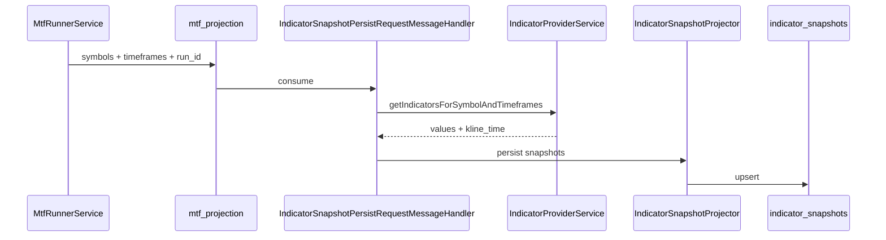
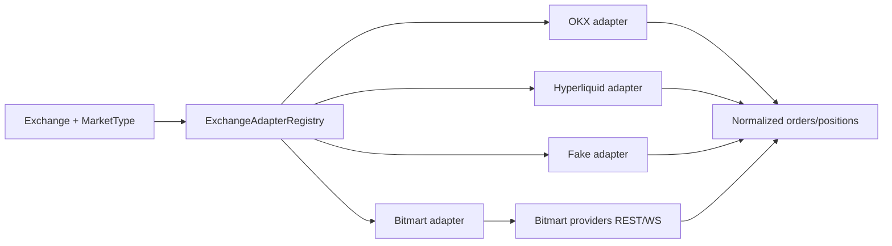
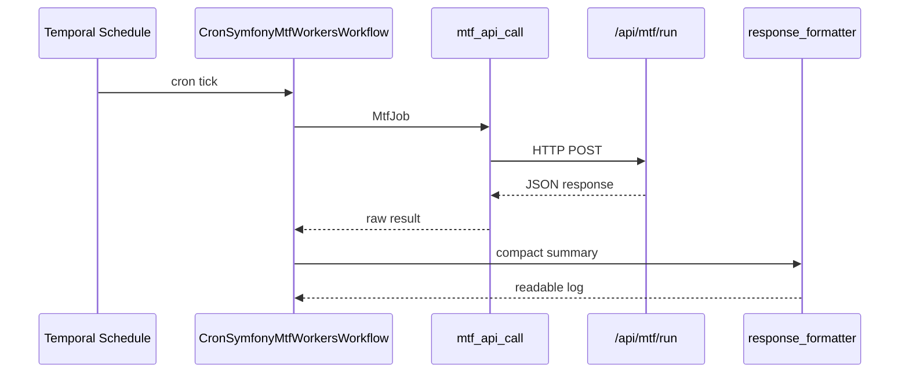
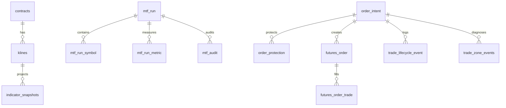

# Graphes des Piles d'Execution

## API MTF Run

```mermaid
sequenceDiagram
    participant Client
    participant RunnerController
    participant MtfRunnerService
    participant MtfValidatorService
    participant MtfValidatorCoreService
    participant TradingDecisionHandler
    participant Messenger

    Client->>RunnerController: POST /api/mtf/run
    RunnerController->>MtfRunnerService: MtfRunnerRequestDto
    MtfRunnerService->>MtfRunnerService: resolve symbols + sync + filters
    MtfRunnerService->>MtfValidatorService: MtfRunRequestDto per symbol
    MtfValidatorService->>MtfValidatorCoreService: run validation
    MtfValidatorCoreService-->>MtfValidatorService: MtfResultDto
    MtfValidatorService-->>MtfRunnerService: SymbolResultDto
    MtfRunnerService->>Messenger: IndicatorSnapshotPersistRequestMessage
    MtfRunnerService->>TradingDecisionHandler: tradable symbol
    TradingDecisionHandler->>Messenger: MtfTradingDecisionMessage
    MtfRunnerService-->>RunnerController: run response
    RunnerController-->>Client: JSON summary
```

## Validation MTF

```mermaid
flowchart TD
    Request[MtfRunDto] --> Config[MtfValidationConfigProvider]
    Request --> Indicators[IndicatorProviderInterface]
    Config --> Core[MtfValidatorCoreService]
    Indicators --> Context[ValidationContextDto]
    Context --> ContextValidation[ContextValidationService]
    ContextValidation --> TimeframeValidation[TimeframeValidationService]
    TimeframeValidation --> Conditions[ConditionRegistry]
    Conditions --> Decisions[TimeframeDecisionDto]
    Decisions --> Selector[ExecutionSelectionService]
    Selector --> Result[MtfResultDto]
```

## TradeEntry

```mermaid
flowchart LR
    Decision[MtfTradingDecisionMessage] --> Handler[MtfTradingDecisionMessageHandler]
    Handler --> Request[TradeEntryRequest]
    Request --> Service[TradeEntryService]
    Service --> Pre[BuildPreOrder]
    Pre --> Plan[BuildOrderPlan]
    Plan --> Exec[ExecuteOrderPlan]
    Exec --> Exchange[ExchangeExecutionService]
    Exec --> Watchers[LimitFill / OutOfZone / Cancel messages]
    Exec --> Protection[TpSlTwoTargetsService]
    Exchange --> Orders[(order_intent / futures_order)]
    Protection --> Lifecycle[(trade_lifecycle_event)]
    Watchers --> OrderTimeout[(order_timeout)]
```

## Messenger

```mermaid
flowchart TD
    subgraph mtf_projection
      A[MtfResultProjectionMessage] --> B[MtfResultProjectionMessageHandler]
      C[IndicatorSnapshotProjectionMessage] --> D[IndicatorSnapshotProjectionMessageHandler]
      E[IndicatorSnapshotPersistRequestMessage] --> F[IndicatorSnapshotPersistRequestMessageHandler]
    end

    subgraph mtf_decision
      G[MtfTradingDecisionMessage] --> H[MtfTradingDecisionMessageHandler]
    end

    subgraph order_timeout
      I[CancelOrderMessage] --> J[CancelOrderMessageHandler]
      K[LimitFillWatchMessage] --> L[LimitFillWatchMessageHandler]
      M[OutOfZoneWatchMessage] --> N[OutOfZoneWatchMessageHandler]
    end
```

## Projection Indicateurs

```mermaid
sequenceDiagram
    participant Runner as MtfRunnerService
    participant Bus as mtf_projection
    participant Handler as IndicatorSnapshotPersistRequestMessageHandler
    participant Provider as IndicatorProviderService
    participant Projector as IndicatorSnapshotProjector
    participant Db as indicator_snapshots

    Runner->>Bus: symbols + timeframes + run_id
    Bus->>Handler: consume
    Handler->>Provider: getIndicatorsForSymbolAndTimeframes
    Provider-->>Handler: values + kline_time
    Handler->>Projector: persist snapshots
    Projector->>Db: upsert
```

## Exchange Runtime

```mermaid
flowchart LR
    Context[Exchange + MarketType] --> Registry[ExchangeAdapterRegistry]
    Registry --> Bitmart[Bitmart adapter]
    Registry --> Okx[OKX adapter]
    Registry --> Hyper[Hyperliquid adapter]
    Registry --> Fake[Fake adapter]
    Bitmart --> Provider[Bitmart providers REST/WS]
    Okx --> Orders[Normalized orders/positions]
    Hyper --> Orders
    Fake --> Orders
    Provider --> Orders
```

## Temporal Schedule

```mermaid
sequenceDiagram
    participant Schedule as Temporal Schedule
    participant Workflow as CronSymfonyMtfWorkersWorkflow
    participant Activity as mtf_api_call
    participant Symfony as /api/mtf/run
    participant Formatter as response_formatter

    Schedule->>Workflow: cron tick
    Workflow->>Activity: MtfJob
    Activity->>Symfony: HTTP POST
    Symfony-->>Activity: JSON response
    Activity-->>Workflow: raw result
    Workflow->>Formatter: compact summary
    Formatter-->>Workflow: readable log
```

## Donnees

```mermaid
erDiagram
    contracts ||--o{ klines : has
    klines ||--o{ indicator_snapshots : projects
    mtf_run ||--o{ mtf_run_symbol : contains
    mtf_run ||--o{ mtf_run_metric : measures
    mtf_run ||--o{ mtf_audit : audits
    order_intent ||--o{ order_protection : protects
    order_intent ||--o{ futures_order : creates
    futures_order ||--o{ futures_order_trade : fills
    order_intent ||--o{ trade_lifecycle_event : logs
    order_intent ||--o{ trade_zone_events : diagnoses
```
