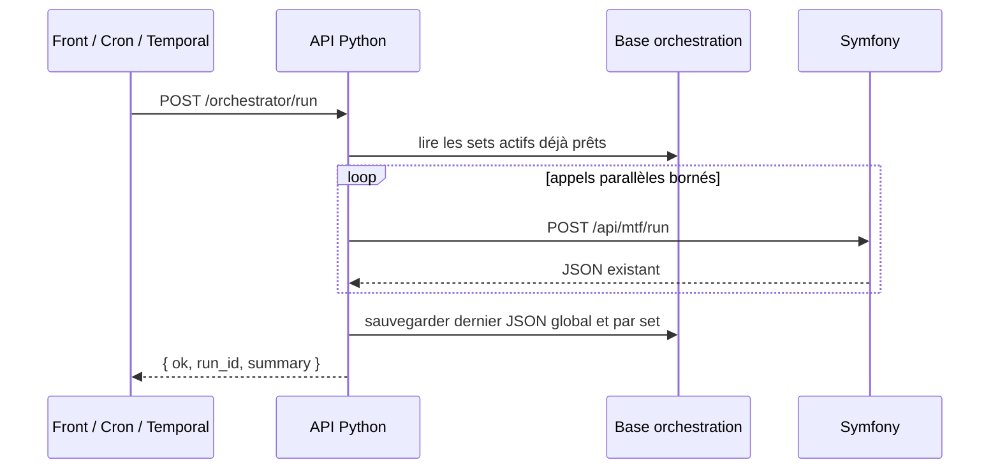
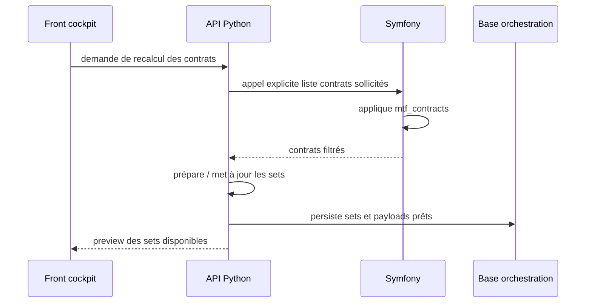

# Python orchestrator

## Statut

Cette page décrit la cible fonctionnelle retenue pour l'orchestration des appels TradingV3.

L'API Python devient l'orchestrateur principal. Temporal reste un déclencheur planifié basique et Symfony reste le moteur métier MTF.

## Objectif

Remplacer le modèle "un worker lance un gros traitement" par un modèle où l'API Python :

1. lit des sets de payloads déjà préparés ;
2. lance plusieurs appels Symfony en parallèle ;
3. garde `workers=1` côté Symfony au début ;
4. agrège les résultats ;
5. sauvegarde le dernier JSON retourné ;
6. expose une visualisation fonctionnelle au front.

Le but n'est pas d'augmenter le nombre de trades. Le but est de mieux contrôler les appels, isoler les erreurs, comparer les modes et réduire les mauvais trades.

## Responsabilités

| Composant | Rôle |
| --- | --- |
| Front cockpit | Configure les sets, force une mise à jour des contrats, déclenche un run, visualise le dernier JSON. |
| API Python | Orchestre, parallélise, agrège, persiste les sets et les résultats. |
| Symfony | Fournit la liste des contrats sollicités, exécute `/api/mtf/run`, conserve la logique métier trading. |
| Temporal | Déclenche périodiquement `/orchestrator/run` et reçoit OK / non OK. |
| PostgreSQL | Stocke la configuration d'orchestration, les sets prêts, les runs et le dernier JSON. |

## Flux fonctionnel principal



## Mise à jour des contrats

La récupération des contrats depuis Symfony ne se fait pas à chaque run.

Elle se fait uniquement lors d'un changement de configuration ou via une action explicite du front.



## Lien avec `mtf_contracts`

Symfony reste la source de vérité pour la sélection initiale des contrats. La configuration `mtf_contracts` filtre déjà les contrats selon :

- activation de la sélection ;
- devise de cotation ;
- statut du contrat ;
- turnover 24h minimal ;
- séparation TOP / MID ;
- limite `top_n` ;
- limite `mid_n`.

L'évolution fonctionnelle attendue est d'ajouter une notion de quotas ou de répartition par exchange, profil, environnement ou set.

Exemples fonctionnels :

```text
Bitmart regular live        -> 30 contrats
Bitmart scalper live        -> 20 contrats
OKX regular dry-run         -> 20 contrats
Hyperliquid regular dry-run -> 20 contrats
Scalper micro               -> 10 contrats
```

## Sets de payloads

Un set est une unité fonctionnelle prête à être exécutée.

Un set peut représenter :

- un exchange ;
- un profil MTF ;
- un environnement ;
- une liste de contrats ;
- une action ;
- un niveau de priorité ;
- un statut `enabled` / `disabled` ;
- un mode `dry_run` / live.

Exemple fonctionnel :

```json
{
  "set_id": "bitmart_regular_live_top_30",
  "enabled": true,
  "action": "mtf_run",
  "exchange": "bitmart",
  "market_type": "perpetual",
  "mtf_profile": "regular",
  "environment": "mainnet",
  "dry_run": false,
  "workers": 1,
  "symbols": ["BTCUSDT", "ETHUSDT"],
  "priority": 10
}
```

Au moment du run, l'API Python ne recalcule pas ce set. Elle le lit, l'exécute, puis sauvegarde le résultat.

## Déclenchement

L'endpoint cible est :

```text
POST /orchestrator/run
```

Il doit :

1. créer un `run_id` ;
2. lire les sets actifs ;
3. appliquer les garde-fous fonctionnels ;
4. lancer les appels en parallèle avec concurrence bornée ;
5. attendre tous les résultats ;
6. agréger ;
7. sauvegarder le dernier JSON ;
8. retourner un statut court.

## Réponse minimale

```json
{
  "ok": false,
  "run_id": "run_20260616_001",
  "status": "partial_failure",
  "summary": {
    "total_calls": 6,
    "success": 5,
    "failed": 1
  }
}
```

Le front peut ensuite récupérer le détail complet depuis l'API Python.

## Dernier JSON retourné

L'API Python garde toujours :

- le dernier JSON global du run ;
- le dernier JSON par set ;
- les payloads envoyés ;
- les réponses Symfony brutes ;
- le résumé affichable ;
- les erreurs.

Le front peut donc afficher le même type de retour que le retour existant de Symfony, avec une vue supplémentaire par set.

## Garde-fous fonctionnels

Avant tout run :

- ne jamais lancer deux sets live incompatibles sur le même symbole ;
- ne pas autoriser OKX live ;
- ne pas autoriser Hyperliquid live ;
- garder `workers=1` côté Symfony au début ;
- borner la concurrence globale ;
- refuser les valeurs dangereuses de workers, concurrence ou nombre de contrats ;
- conserver une trace du dernier payload et de la dernière réponse ;
- ne pas déclencher des trades simplement pour augmenter la fréquence.

## Hors-scope de la première PR code

La première PR technique de l'API Python ne doit pas encore gérer tout le trading live.

Elle peut se limiter à :

- squelette API ;
- endpoint `/orchestrator/run` ;
- lecture de sets persistés ou simulés ;
- appels parallèles dry-run ;
- stockage du dernier JSON ;
- visualisation minimale.

Le live orchestré nécessite une étape dédiée avec idempotence, locks et validation côté Symfony.
