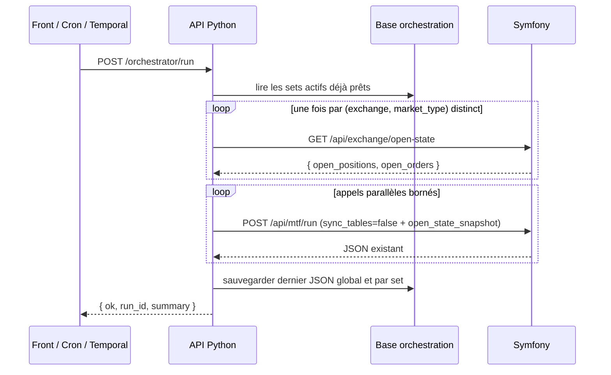
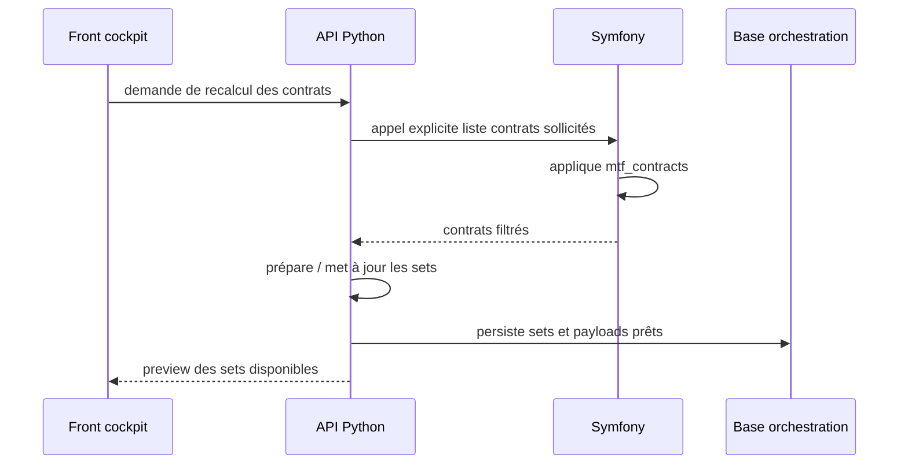

# Python orchestrator

## Statut

Cette page décrit la cible fonctionnelle retenue pour l'orchestration des appels TradingV3.

L'API Python devient l'orchestrateur principal. Temporal reste un déclencheur planifié basique et Symfony reste le moteur métier MTF.

## Objectif

Remplacer le modèle "un worker lance un gros traitement" par un modèle où l'API Python :

1. lit des sets de payloads déjà préparés ;
2. lance plusieurs appels Symfony en parallèle ;
3. garde `workers=1` côté Symfony au début ;
4. agrège les résultats ;
5. sauvegarde le dernier JSON retourné ;
6. expose une visualisation fonctionnelle au front.

Le but n'est pas d'augmenter le nombre de trades. Le but est de mieux contrôler les appels, isoler les erreurs, comparer les modes et réduire les mauvais trades.

## Responsabilités

| Composant | Rôle |
| --- | --- |
| Front cockpit | Configure les sets, force une mise à jour des contrats, déclenche un run, visualise le dernier JSON. |
| API Python | Orchestre, parallélise, agrège, persiste les sets et les résultats. |
| Symfony | Fournit la liste des contrats sollicités, exécute `/api/mtf/run`, conserve la logique métier trading. |
| Temporal | Déclenche périodiquement `/orchestrator/run` et reçoit OK / non OK. |
| PostgreSQL | Stocke la configuration d'orchestration, les sets prêts, les runs et le dernier JSON. |

## Flux fonctionnel principal



### Snapshot d'état ouvert partagé (SF-002b)

Pour éviter un appel exchange par set, l'orchestrateur récupère l'état ouvert
(positions/ordres) **une seule fois par couple `(exchange, market_type)` distinct**
parmi les sets `mtf_run` actifs, via `GET /api/exchange/open-state`, puis transmet
ce snapshot à chaque `POST /api/mtf/run` dans le champ `open_state_snapshot` avec
`sync_tables=false`. Côté Symfony, la présence du snapshot **court-circuite**
totalement le fetch exchange (priorité : snapshot > `sync_tables=true` > filtre).

**Fail-closed live (phase actuelle)** : tant que la readiness live n'est pas
livrée, `assert_set_persistable` interdit la persistance de **tout** set live
(`dry_run=false`, tous exchanges/environnements). Le runner DB-backed applique la
même politique de bout en bout : **tout set effectivement live est skippé**
(marqué en erreur, aucun `POST /api/mtf/run`), **même sur un exchange autorisé et
même avec un snapshot disponible**, car la seule façon d'obtenir une ligne live
est de contourner l'API. Seul un override run-level `dry_run=true` rend un set
exécutable (en dry). Ce garde-fou sera relâché quand la readiness live
(SAFE-001/SAFE-002, TM-001) sera livrée.

**Fail-closed live (post-readiness)** : si le fetch du snapshot échoue pour un
couple, les sets **live** (`dry_run=false`) de ce couple sont marqués en erreur et
**ne sont pas exécutés** (on ne trade pas à l'aveugle). Les sets **dry-run**
peuvent continuer sans snapshot. Ce garde-fou côté orchestrateur est doublé côté
Symfony : `MtfRunnerService` rejette tout run live dépourvu de source d'état
ouvert fiable (pas de snapshot ET `sync_tables=false` ET
`skip_open_state_filter=true`).

## Mise à jour des contrats

La récupération des contrats depuis Symfony ne se fait pas à chaque run.

Elle se fait uniquement lors d'un changement de configuration ou via une action explicite du front.



## API Symfony : contrats sélectionnés (SF-001)

Symfony expose la liste des contrats réellement retenus par `mtf_contracts`, sans
déclencher de run (la file MTF switch n'est PAS consommée), via :

```text
GET /api/mtf/contracts
```

Paramètres (query string) :

- `profile` / `mtf_profile` : profil de configuration (défaut = mode TradeEntry actif) ;
- `exchange` / `cex` : exchange (`bitmart`, `okx`, `hyperliquid`, ... ; défaut `bitmart`) ;
- `market_type` / `type_contract` : type de marché (alias `futures`/`perp` acceptés ;
  défaut `perpetual`).

Comportements explicites :

- un `exchange` / `market_type` non supporté renvoie `400` ;
- en cas d'erreur interne, le message reste générique (les détails vont dans les logs),
  réponse `{ "ok": false, "error": ... }` en `500`.

Réponse type (forme **plate**, telle que renvoyée par `ContractsApiController`) :

```json
{
  "ok": true,
  "profile": "scalper_micro",
  "exchange": "bitmart",
  "market_type": "perpetual",
  "count": 2,
  "symbols": ["BTCUSDT", "ETHUSDT"],
  "filters": {
    "quote_currency": "USDT",
    "status": "Trading",
    "min_turnover": 1500000,
    "mid_max_turnover": null,
    "top_n": 140,
    "mid_n": 0
  }
}
```

C'est cet endpoint que l'API Python appelle lors du refresh explicite des contrats
(voir ci-dessous) pour mettre à jour la sélection de symboles de ses sets.

## API Python : refresh explicite des contrats (PY-003)

L'orchestrateur ne recalcule pas la sélection à chaque run : elle est rafraîchie
**explicitement** (changement de config ou demande du front) via :

```text
POST /dashboards/{dashboard_id}/refresh-contracts
```

Déroulé :

- charge les sets **actifs** d'action `mtf_run` du dashboard ;
- regroupe par couple distinct `(mtf_profile, exchange, market_type)` et appelle
  `GET /api/mtf/contracts` **une seule fois par groupe** (mise en cache) ;
- **fail-closed** : si le fetch d'un seul groupe échoue, la route renvoie `502`
  **sans aucune écriture** (les sets gardent leur sélection précédente) ;
- sinon, pour chaque set, écrit `symbols = symbols_du_profil[:contracts_limit]`
  (tronqué si `contracts_limit` est défini, sinon la sélection complète) puis
  committe l'ensemble en une seule transaction ;
- renvoie un aperçu par set.

Réponse type :

```json
{
  "dashboard_id": 1,
  "count": 2,
  "sets": [
    {
      "set_id": "bitmart_scalper_top",
      "mtf_profile": "scalper_micro",
      "exchange": "bitmart",
      "market_type": "perpetual",
      "symbol_count": 140,
      "contracts_limit": 140,
      "filters": { "quote_currency": "USDT", "top_n": 140 }
    }
  ]
}
```

> Le refresh régénère aussi le `payload` `/api/mtf/run` de chaque set rafraîchi
> (PY-004, ci-dessous). L'exécution parallèle qui consomme ce payload (PY-005)
> reste hors du périmètre de ce refresh.

## Payload `/api/mtf/run` préparé (PY-004)

Chaque set persistant porte un `payload` **prêt à l'emploi** pour `/api/mtf/run`,
produit côté serveur à partir de ses champs typés. Objectif : PY-005 exécute le set
tel quel (« sets prêts → runs parallèles »), sans recomposer le payload au run.

- **Génération automatique** : le `payload` est (re)généré à chaque écriture qui change
  la config du set — `POST .../sets` (création), `PATCH .../sets/{id}` (mise à jour),
  `POST .../refresh-contracts` (refresh des symboles). Il n'est donc jamais périmé.
- **Lecture seule** : `payload` n'est pas accepté en entrée (`SetCreate`/`SetUpdate`
  l'excluent) — un payload fourni par un client est ignoré. Il est exposé via `SetRead`.
- **Forme** : même cœur que le payload runtime (`build_mtf_payload`). `sync_tables` et
  `process_tp_sl` sont forcés à `false`. Le `payload` **n'inclut pas**
  `open_state_snapshot` (valeur runtime récupérée à chaque run, pas une donnée de
  configuration) ni d'override `dry_run` run-level (il reflète le `dry_run` configuré du set).
- **Sélection non matérialisée ⇒ `payload` `null`** : un set valide par sa seule
  `contracts_limit` (donc `symbols` encore vide) n'a pas de payload tant qu'un refresh n'a
  pas renseigné de symboles concrets. `/api/mtf/run` n'ayant aucun paramètre de cap, un
  payload sans `symbols` y signifierait « tout l'univers actif » — jamais l'intention d'un
  set capé. On laisse donc le `payload` `null` plutôt que de persister un « run-all »
  trompeur ; au run, PY-005 n'exécute pas un set sans payload (aucun appel Symfony, set
  compté en échec « not materialized » dans le `RunSet`).

```json
{
  "dry_run": true,
  "workers": 1,
  "exchange": "bitmart",
  "market_type": "perpetual",
  "mtf_profile": "scalper_micro",
  "sync_tables": false,
  "process_tp_sl": false,
  "symbols": ["BTCUSDT", "ETHUSDT"]
}
```

## Lien avec `mtf_contracts`

Symfony reste la source de vérité pour la sélection initiale des contrats. La configuration `mtf_contracts` filtre déjà les contrats selon :

- activation de la sélection ;
- devise de cotation ;
- statut du contrat ;
- turnover 24h minimal ;
- séparation TOP / MID ;
- limite `top_n` ;
- limite `mid_n`.

L'évolution fonctionnelle attendue est d'ajouter une notion de quotas ou de répartition par exchange, profil, environnement ou set.

Exemples fonctionnels :

```text
Bitmart regular live        -> 30 contrats
Bitmart scalper live        -> 20 contrats
OKX regular dry-run         -> 20 contrats
Hyperliquid regular dry-run -> 20 contrats
Scalper micro               -> 10 contrats
```

## Sets de payloads

Un set est une unité fonctionnelle prête à être exécutée.

Un set peut représenter :

- un exchange ;
- un profil MTF ;
- un environnement ;
- une liste de contrats ;
- une action ;
- un niveau de priorité ;
- un statut `enabled` / `disabled` ;
- un mode `dry_run` / live.

Exemple fonctionnel cible :

```json
{
  "set_id": "bitmart_regular_live_top_30",
  "enabled": true,
  "action": "mtf_run",
  "exchange": "bitmart",
  "market_type": "perpetual",
  "mtf_profile": "regular",
  "environment": "mainnet",
  "dry_run": false,
  "workers": 1,
  "sync_tables": false,
  "symbols": ["BTCUSDT", "ETHUSDT"],
  "priority": 10
}
```

Au moment du run, l'API Python ne recalcule pas ce set. Elle le lit, l'exécute, puis sauvegarde le résultat.

## Dépendance Symfony : `sync_tables=false`

Pour que le modèle "sets déjà prêts" fonctionne, Symfony doit pouvoir exécuter `/api/mtf/run` sans relancer une synchronisation des tables exchange/open-state à chaque appel.

La cible fonctionnelle est :

```text
refresh explicite des contrats
→ sets préparés
→ runs parallèles avec sync_tables=false
```

Donc une PR technique devra faire accepter et respecter un champ équivalent à :

```json
{
  "sync_tables": false
}
```

Règles attendues :

- `sync_tables=true` reste le comportement legacy par défaut ;
- `sync_tables=false` est utilisé uniquement par l'orchestrateur Python sur des sets déjà préparés ;
- si Symfony ne sait pas encore honorer `sync_tables=false`, les runs parallèles ne doivent pas être considérés comme prêts pour la cible ;
- le front doit distinguer "refresh contrats" et "run des sets".

Sans ce contrat, chaque set pourrait encore déclencher une sync Symfony, ce qui annulerait le bénéfice du flux de refresh explicite.

> ⚠️ **Portée de `sync_tables=false` seul (SF-002a).** `sync_tables=false` saute
> uniquement l'upsert DB ; le filtre d'activité peut encore appeler l'exchange.
> Le vrai mode « zéro appel exchange par set » est livré par **SF-002b** via le
> snapshot orchestrateur ci-dessous.

## Endpoint Symfony : état ouvert (SF-002b)

```text
GET /api/exchange/open-state?exchange=bitmart&market_type=perpetual
```

Endpoint **en lecture seule** qui produit l'instantané d'état ouvert que
l'orchestrateur récupère une seule fois puis distribue à tous les sets. Réponse :

```json
{
  "open_positions": [ { "symbol": "BTCUSDT", "side": "long", "size": "1.5", "...": "..." } ],
  "open_orders":    [ { "symbol": "ETHUSDT", "order_id": "...", "side": "buy", "...": "..." } ]
}
```

- `exchange` / `market_type` : optionnels (défauts `bitmart` / `perpetual`), même
  jeu accepté que `/api/mtf/run` ; une valeur invalide renvoie `400`.
- L'orchestrateur joint ce JSON tel quel dans `open_state_snapshot` du payload
  `/api/mtf/run` (avec `sync_tables=false`).

> **Exchange `fake` (sets de démo).** Les sets simulés en mémoire
> (`app/services/sets.py`) utilisent `exchange=fake` / `market_type=perpetual`.
> Symfony enregistre désormais un **bundle de providers Fake** (contexte
> `fake_perpetual` / `fake_spot`, voir `config/services.yaml`) : `MainProvider::forContext(FAKE, …)`
> résout sans erreur. Le provider Fake modélise un exchange vide/neutre :
> `GET /api/exchange/open-state?exchange=fake&market_type=perpetual` renvoie
> `{"open_positions":[],"open_orders":[]}`, et le provider de contrats Fake
> n'expose **aucun symbole actif** — un `POST /api/mtf/run` sur le contexte FAKE
> résout 0 symbole et se termine en succès trivial, sans aucun appel HTTP réel ni
> exécution live. C'est ce qui permet au chemin de démo (`exchange=fake`) de
> tourner de bout en bout depuis `/orchestrator/run`.

## Déclenchement

L'endpoint cible est :

```text
POST /orchestrator/run
```

Il doit :

1. créer un `run_id` ;
2. lire les sets actifs ;
3. appliquer les garde-fous fonctionnels ;
4. lancer les appels en parallèle avec concurrence bornée ;
5. attendre tous les résultats ;
6. agréger ;
7. sauvegarder le dernier JSON ;
8. retourner un statut court.

## Réponse minimale

```json
{
  "ok": false,
  "run_id": "run_20260616_001",
  "status": "partial_failure",
  "summary": {
    "total_calls": 6,
    "success": 5,
    "failed": 1
  }
}
```

Le front peut ensuite récupérer le détail complet depuis l'API Python.

## Dernier JSON retourné

L'API Python garde toujours :

- le dernier JSON global du run ;
- le dernier JSON par set ;
- les payloads envoyés ;
- les réponses Symfony brutes ;
- le résumé affichable ;
- les erreurs.

Le front peut donc afficher le même type de retour que le retour existant de Symfony, avec une vue supplémentaire par set.

### Lecture de l'historique (PY-006)

L'écriture de cet historique est faite par PY-005 (`POST /orchestrator/run`).
PY-006 ajoute la surface **en lecture seule** consommée par le cockpit :

| Méthode | Chemin | Rôle |
| --- | --- | --- |
| `GET` | `/runs` | Liste des runs (vue allégée), filtrable par `dashboard_id`, paginée (`limit` ≤ 100, `offset`), du plus récent au plus ancien. |
| `GET` | `/runs/{run_id}` | Détail complet : dernier JSON global (`last_json`) + détail par set (`sets[]`). |
| `GET` | `/runs/{run_id}/sets/{set_id}` | Dernier JSON d'un set : `payload_sent`, `response_json` brute, `error`, `duration_ms`. |
| `GET` | `/dashboards/{id}/runs` | Runs d'un dashboard (vue allégée, paginée). |
| `GET` | `/dashboards/{id}/runs/latest` | Dernier run d'un dashboard (détail complet) — le retour affiché par défaut au cockpit ; `404` si aucun run. |

La vue allégée (`RunSummaryRead`) omet `last_json` et le détail par set pour
rester légère sur les listes ; le détail (`RunDetailRead`) porte le dernier JSON
global et la liste des sets (triés par `set_id`). Ces endpoints n'écrivent rien.

## Schéma de persistance (DB-001)

La persistance est implémentée dans `python-orchestrator/` avec **SQLAlchemy 2.0 + Alembic**
(driver `psycopg` sync). Les tables vivent dans un **schéma PostgreSQL dédié `orchestration`**
au sein de la base `trading_app` existante, afin de ne pas interférer avec les migrations
Doctrine de Symfony (qui n'introspecte que `public`).

| Table | Rôle |
| --- | --- |
| `dashboards` | Configurations d'orchestration (nom, statut actif). |
| `orchestration_sets` | Sets prêts à exécuter (miroir d'`OrchestratorSet`, dont `sync_tables`, `symbols`, `contracts_limit`, et le `payload` préparé). |
| `runs` | Runs déclenchés (`run_id`, statut, compteurs, idempotency_key, `expires_at` = TTL du claim « en vol ») + **dernier JSON global** (`last_json`). |
| `run_sets` | Détail par set d'un run (payload envoyé, réponse Symfony, statut, erreur, durée) + **dernier JSON par set** (`response_json`). |
| `orchestration_locks` | Locks d'orchestration par `(mtf_profile, exchange, market_type, symbol)` sérialisant deux runs concurrents (**SAFE-001**). |

DB-001 ne livre que la couche schéma (modèles, migration, moteur/session, repositories).

### Locks d'orchestration (SAFE-001)

La table `orchestration_locks` empêche deux exécutions concurrentes (overlap du
cron Temporal `BUFFER_ONE`, ou front + cron) de traiter le **même couple
`(mtf_profile, exchange, market_type, symbol)`** en même temps. Le garde intra-run
(`_conflicting_live_set_ids`) ne couvre qu'un seul batch ; sans lock partagé en
base, l'activation future du live exposerait à des soumissions dupliquées sur un
même instrument. SAFE-001 est un **prérequis** au relâchement de la readiness live
(avec SAFE-002/SAFE-003) ; il **ne réactive pas le live** (tout set `dry_run=false`
reste skippé par le runner).

| Colonne | Rôle |
| --- | --- |
| `lock_key` (UNIQUE) | Clé canonique `{profile}\|{exchange}\|{market_type}\|{symbol}` — **c'est la contrainte d'unicité qui réalise l'exclusion mutuelle**. |
| `mtf_profile`, `exchange`, `market_type`, `symbol` | Composantes dénormalisées (exchange/market_type normalisés comme Symfony, symbole en MAJUSCULES comme `_symbols_overlap`). |
| `run_id` | Titulaire courant ; libère ses locks par `run_id` à la fin du set. |
| `acquired_at`, `expires_at` (indexé) | TTL anti-deadlock. `expires_at` = pire temps de paroi du run (`ceil(n_sets / max_concurrency)` × timeout Symfony) + marge `ORCHESTRATION_LOCK_TTL_SECONDS` (défaut 1800s), pour qu'un set resté en file n'expire jamais avant son dispatch. |

**Acquisition** (avant le dispatch de chaque set, dans une transaction courte
committée **avant** les appels Symfony — jamais maintenue pendant les ~900s) :
pour chaque set on dérive un `lock_key` **par symbole** (symboles normalisés
UPPERCASE), puis on insère sous `SAVEPOINT` (rattrapage `IntegrityError`,
compatible SQLite/PostgreSQL). Un lock **expiré** (`expires_at <= now`, comparaison
côté SQL) est *reclaim* (supprimé) avant l'insertion. L'acquisition est **tout ou
rien** par set : si un symbole du set est déjà détenu par un run actif, les locks
déjà pris pour ce set sont relâchés et le set est **skippé fail-closed**
(`ok=false`, `body="locked: <key> held by run <id>"`), tandis que les autres sets
du run continuent.

**Libération** : dans le `finally` de chaque set (succès, échec métier ou
exception), les locks détenus par ce `run_id` sont supprimés. Un **balayage des
locks expirés au démarrage** du run (`purge_expired_locks`) évite les fuites si un
process est tué avant son `finally`.

**Périmètre** : le lock est posé pour **tous** les sets `mtf_run` (pas seulement
les sets live) — l'infra est ainsi testable dès maintenant, la sérialisation
per-symbole/profil étant inoffensive en dry-run. Un set à `symbols` vide (univers
complet) ne pose aucun lock : il n'est de toute façon pas dispatché
(`run_persisted_set` exige une sélection matérialisée). Le `now` est lu via
`datetime.now(timezone.utc)` (aucune contrainte Temporal ici) et injectable en test.

### Statuts de run et idempotence à l'exécution (SAFE-002)

SAFE-001 sérialise les dispatches concurrents **au grain symbole**, mais ne fournit
pas la sémantique de replay/reprise **au grain run**. SAFE-002 rend
`POST /orchestrator/run` idempotent **à l'exécution** lorsqu'un **ancrage
d'idempotence** existe (`idempotency_key`, ou `dashboard_id` + `tick_timestamp` →
`run_id` stable). Un `run_id` aléatoire (aucun contexte) reste non idempotent.

**Statuts de run** (centralisés dans `app/schemas.py`) :

| Statut | Terminal ? | Sens |
| --- | --- | --- |
| `running` | non | **Claim « en vol »** posé au démarrage du run (avant le dispatch). |
| `success` | oui | Tous les sets exécutés réussis (`ok=true`). |
| `partial_failure` | oui | Au moins un succès et au moins un échec. |
| `failed` | oui | Aucun set réussi. |
| `no_sets` | — | Aucun set à exécuter ; **jamais persisté** (inchangé). |

**Claim précoce** : avant le dispatch — dans une **transaction courte committée**
(comme les locks SAFE-001, jamais maintenue pendant les ~900s) — on pose/résout la
ligne `Run` via `claim_run` (variante *compare-and-set* de `record_run`, savepoint
anti-course réutilisé) avec `status="running"`, `started_at`, et
`expires_at = now + TTL de claim`. `claim_run` ne remplace une ligne existante que
si elle **n'est pas** un claim actif. Deux courses sont neutralisées : (1) **INSERT
concurrent** (la ligne n'existait pas — les deux requêtes ont vu une absence au
pré-check) → savepoint + violation d'unicité, le perdant relit le gagnant ; (2)
**UPDATE concurrent** (reprise/reclaim d'une ligne déjà présente) → le read-modify-
write se fait **sous `SELECT … FOR UPDATE`** (+ `populate_existing` pour ré-évaluer
le claim sur l'état frais), donc deux reprises d'une même ligne périmée ne peuvent
pas toutes deux la ré-écrire : la seconde bloque, relit le claim désormais actif et
s'efface. Dans les deux cas le perdant **réplique l'état en vol sans dispatcher**
plutôt que d'écraser la ligne partagée et de re-soumettre du travail. Le **TTL de claim réutilise
le calcul SAFE-001** du pire temps de paroi du run
(`ceil(n_sets / max_concurrency)` × timeout Symfony + marge `ORCHESTRATION_LOCK_TTL_SECONDS`) :
aucune variable d'environnement dédiée. Le `now` est lu via `orch._now`
(`datetime.now(timezone.utc)`, injectable en test), partagé avec le TTL des locks.

Le **replay** (terminal success) et la **réplique in-flight** (run en vol) sont
résolus **avant le gating `no_sets`** : ils ne nécessitent ni dashboard ni sets, donc
un retry après désactivation/suppression du dashboard (ou avec la seule clé) rejoue
quand même le succès persisté. La **reprise** et le **reclaim**, qui re-exécutent,
restent gated par la disponibilité des sets.

**Court-circuit selon l'état du run existant** (résolu par `run_id` puis
`idempotency_key`) :

| État existant | Action |
| --- | --- |
| terminal `success` (`ok=true`) | **Replay** : `summary`/`run_id` reconstruits depuis `last_json`, **aucun ré-appel Symfony**. |
| terminal non-ok (`failed`/`partial_failure`) | **Reprise** : ré-exécution des seuls sets **sans** `RunSet.ok=true` ; les RunSet réussis sont conservés et fusionnés au `summary`/`last_json` recomposés. |
| `running` **non périmé** | Un autre run est **en vol** : pas de dispatch, réponse de réplique (`ok=false`, `status="running"`, summary courant). |
| `running` **périmé** (TTL dépassé, process tué) | **Reclaim** + ré-exécution comme un nouveau run. |

**Finalisation** : à la fin, le statut terminal résolu (`_resolve_status`) +
`finished_at` sont écrits via le `_persist_run` existant. Le claim initial et la
finalisation portent **le même `run_id`** (on réutilise le `run_id` réellement
persisté renvoyé par `record_run`, y compris quand un run existant est résolu par
`idempotency_key` sous un `run_id` legacy distinct du dérivé).

**Périmètre** : SAFE-002 **ne réactive pas le live** (tout set `dry_run=false` reste
skippé par le runner) et **ne modifie pas** les locks SAFE-001 au-delà de la
coordination claim ↔ locks (même transaction courte, même `now`, même TTL).

> Migration : `0003_run_claim_expires_at` ajoute la colonne nullable
> `orchestration.runs.expires_at` (TTL de claim), dans le schéma dédié
> (aucun impact `public`/Doctrine).

**PY-002** câble la couche DB dans une API REST de **configuration** des dashboards et des
sets (CRUD), sous le préfixe `/dashboards` :

| Méthode | Chemin | Rôle |
| --- | --- | --- |
| `GET` / `POST` | `/dashboards` | Liste / crée un dashboard. |
| `GET` / `PATCH` / `DELETE` | `/dashboards/{id}` | Détail / mise à jour partielle / suppression. |
| `GET` / `POST` | `/dashboards/{id}/sets` | Liste (`?enabled_only=true`) / crée un set. |
| `GET` / `PATCH` / `DELETE` | `/dashboards/{id}/sets/{set_id}` | Détail / mise à jour / suppression d'un set. |

Garde-fous appliqués dès la configuration (revalidés sur les `PATCH` partiels) : borne `workers` ;
**aucun live persistable** (`dry_run=false` refusé pour tous les exchanges/environnements tant que
la readiness live n'est pas livrée) ; **sélection exploitable obligatoire** (`symbols` non vide ou
`contracts_limit`) ; **`payload` non writable** (produit serveur PY-004, lecture seule) ; rejet des
`null` explicites sur les champs NOT NULL ; unicité du nom de dashboard et du `set_id` par dashboard
(`409`) ; `set_id` immuable.

La **lecture des sets persistés au moment du run** et l'**écriture des runs** sont livrées par
**PY-005** : `/orchestrator/run` lit les sets actifs du dashboard depuis la base, exécute chaque set
à partir de son `payload` persisté (+ snapshot runtime + override `dry_run`), puis persiste
l'historique (un `Run` avec `last_json` global, un `RunSet` par set avec `payload_sent`,
`response_json`, `duration_ms`). L'**exposition en lecture** de cet historique (endpoints `GET`)
est livrée par **PY-006** (`GET /runs`, `/runs/{run_id}`, `/runs/{run_id}/sets/{set_id}`,
`/dashboards/{id}/runs`, `/dashboards/{id}/runs/latest`). Les migrations s'appliquent via
`alembic upgrade head` (voir `python-orchestrator/README.md`).

## Garde-fous fonctionnels

Avant tout run :

- ne jamais lancer deux sets live incompatibles sur le même symbole ;
- **idempotence et lock par symbole** (SAFE-001, livré) : deux runs concurrents ne
  peuvent pas traiter le même `(mtf_profile, exchange, market_type, symbol)` en même
  temps. Un lock persistant (`orchestration_locks`, clé `lock_key` UNIQUE) est acquis
  avant le dispatch de chaque set et libéré à sa fin (succès/échec/exception) ; un set
  dont un symbole est déjà verrouillé par un run actif est skippé fail-closed
  (`locked: <key> held by run <id>`). Appliqué à **tous** les sets `mtf_run` (le live
  reste désactivé) ; TTL anti-deadlock + purge des locks expirés au démarrage. Cf.
  *Locks d'orchestration (SAFE-001)*. ;
- **idempotence runs/sets** (SAFE-002, livré) : lorsqu'un ancrage existe (`run_id`
  stable), un run rejoué ne ré-exécute pas le travail. Un **claim** `running` (TTL)
  est posé avant le dispatch (transaction courte) ; un run existant terminal réussi
  est **rejoué** (replay, aucun ré-appel Symfony), un terminal non-ok est **repris**
  (seuls les sets non réussis sont re-dispatchés, les `RunSet.ok=true` conservés), un
  `running` non périmé renvoie l'**état en vol** (`ok=false`, `status="running"`, pas
  de dispatch), un `running` périmé est **reclaim**. Le live reste désactivé. Cf.
  *Statuts de run et idempotence à l'exécution (SAFE-002)*. ;
- ne lancer aucun set live tant que la readiness live n'est pas livrée (tout set
  `dry_run=false` est skippé par le runner, en miroir de `assert_set_persistable`) ;
- ne pas autoriser OKX live (garde permanente, conservée après readiness) ;
- ne pas autoriser Hyperliquid live (garde permanente, conservée après readiness) ;
- garder `workers=1` côté Symfony au début ;
- borner la concurrence globale ;
- refuser les valeurs dangereuses de workers, concurrence ou nombre de contrats ;
- exiger une API Symfony exposant les contrats filtrés par `mtf_contracts` avant de persister des sets réels ;
- exiger le support Symfony de `sync_tables=false` avant d'utiliser des sets préparés en parallèle ;
- conserver une trace du dernier payload et de la dernière réponse ;
- ne pas déclencher des trades simplement pour augmenter la fréquence.

## Plan court de PR atomiques

| PR | Objectif | Résultat attendu |
| --- | --- | --- |
| DOC-001 | Figer la cible fonctionnelle | Documentation actuelle validée. |
| SF-001 ✅ | Exposer les contrats filtrés par `mtf_contracts` | Livré : `GET /api/mtf/contracts` retourne les symboles réellement sélectionnés. |
| PY-001 | Créer le squelette API Python | Service API lancé, endpoint healthcheck, structure projet. |
| DB-001 | Persister dashboards, sets et derniers runs | Tables orchestration + dernier JSON global/par set. |
| SF-002a ✅ | Supporter `sync_tables=false` côté Symfony | Livré : `/api/mtf/run` et `mtf:run` honorent `sync_tables=false` (skip upsert DB). |
| SF-002b ✅ | Snapshot d'état ouvert orchestrateur (zéro appel exchange par set) | Livré : `GET /api/exchange/open-state` + `open_state_snapshot` sur `/api/mtf/run` ; fail-closed live côté Symfony et orchestrateur. |
| PY-002 ✅ | Implémenter `/orchestrator/run` (squelette parallèle) | Livré : fetch snapshot 1×/(exchange,market_type), appels parallèles bornés, agrégation, fail-closed live. Lecture DB des sets + persistance livrées par PY-005. |
| PY-003 ✅ | Refresh explicite des contrats | Livré : `POST /dashboards/{id}/refresh-contracts` fetch `GET /api/mtf/contracts` 1×/(profil,exchange,market_type), persiste `symbols` (cap `contracts_limit`), fail-closed 502 sans écriture partielle, aperçu par set. |
| PY-004 ✅ | Générer le `payload` `/api/mtf/run` des sets | Livré : `payload` produit côté serveur (cœur partagé avec `build_mtf_payload`, `sync_tables`/`process_tp_sl=false`, sans snapshot) et régénéré à chaque create/update/refresh ; lecture seule via `SetRead`. |
| PY-005 ✅ | Exécuter les sets persistés + persister les runs | Livré : `/orchestrator/run` lit les sets actifs du dashboard depuis la base, exécute chaque set via son `payload` persisté (+ snapshot runtime + override `dry_run`), et persiste le run (`Run.last_json` global + un `RunSet` par set avec `payload_sent`/`response_json`/`duration_ms`). `no_sets` reste `ok=false`. Garde-fou live défense-en-profondeur au run : OKX/Hyperliquid live (ligne ORM écrite hors API) sont fail-closed avant tout dispatch. |
| PY-006 ✅ | Exposer l'historique des runs en lecture | Livré : endpoints `GET` en lecture seule du dernier JSON global et par set (`/runs`, `/runs/{run_id}`, `/runs/{run_id}/sets/{set_id}`, `/dashboards/{id}/runs`, `/dashboards/{id}/runs/latest`) ; vue allégée paginée pour les listes, détail complet `last_json` + sets. |
| SAFE-001 ✅ | Locks d'orchestration par symbole et profil | Livré : table `orchestration_locks` (clé `lock_key` UNIQUE), acquisition tout-ou-rien par set avant dispatch (transaction courte, reclaim des locks expirés, skip fail-closed `locked: …`), libération en fin de set, purge des expirés au démarrage. Prérequis readiness live ; ne réactive pas le live. |
| SAFE-002 ✅ | Idempotence des runs et des sets | Livré : statut non terminal `running` + claim précoce (`runs.expires_at` = TTL de claim, transaction courte) ; court-circuit selon l'état du run existant — replay (terminal success), reprise des sets non réussis (terminal non-ok), réplique en vol (`running` non périmé), reclaim (`running` périmé). Réutilise `record_run`/savepoints et le calcul de TTL SAFE-001. Migration `0003_run_claim_expires_at`. Ne réactive pas le live. |
| UI-001 | Ajouter cockpit minimal | Liste des sets, preview, dernier JSON, erreurs par set. |
| TM-001 | Brancher Temporal en cron basique | Une activity appelle `/orchestrator/run` et échoue si `ok=false`. |

Ce plan reste volontairement court. Les issues et prompts détaillés seront créés au moment de chaque PR.

## Endpoint contrats filtrés (SF-001)

`GET /api/mtf/contracts` expose, en lecture seule, les symboles sélectionnés par
`mtf_contracts`. Il réutilise le même chemin que le runner
(`ContractRepository::allActiveSymbolNames`) sans consommer la file MTF switch.

Paramètres de requête (tous optionnels) :

| Param | Alias | Défaut | Rôle |
| --- | --- | --- | --- |
| `profile` | `mtf_profile` | 1er mode activé, sinon config fallback | Profil de configuration `mtf_contracts.<profile>.yaml`. |
| `exchange` | `cex` | `bitmart` | Exchange ciblé. |
| `market_type` | `type_contract` | `perpetual` | Type de marché. |

Réponse :

```json
{
  "ok": true,
  "profile": "scalper_micro",
  "exchange": "bitmart",
  "market_type": "perpetual",
  "count": 42,
  "symbols": ["BTCUSDT", "ETHUSDT"],
  "filters": {
    "quote_currency": "USDT",
    "status": "Trading",
    "min_turnover": 1500000,
    "mid_max_turnover": 8000000,
    "top_n": 140,
    "mid_n": 0
  }
}
```

L'API Python utilise cet endpoint lors du « refresh contrats » pour préparer les sets.

## Hors-scope de la première PR code

La première PR technique de l'API Python ne doit pas encore gérer tout le trading live.

Elle peut se limiter à :

- squelette API ;
- endpoint `/orchestrator/run` ;
- lecture de sets persistés ou simulés ;
- appels parallèles dry-run ;
- stockage du dernier JSON ;
- visualisation minimale.

Le live orchestré nécessite une étape dédiée avec idempotence, locks, support `sync_tables=false` et validation côté Symfony.
