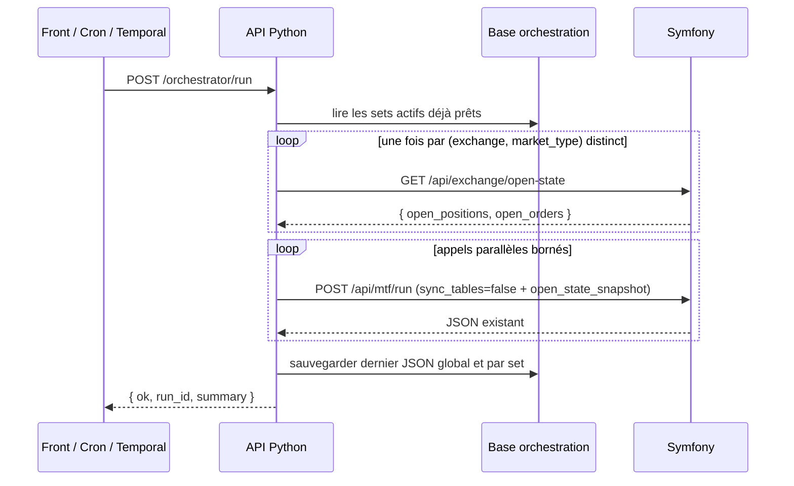
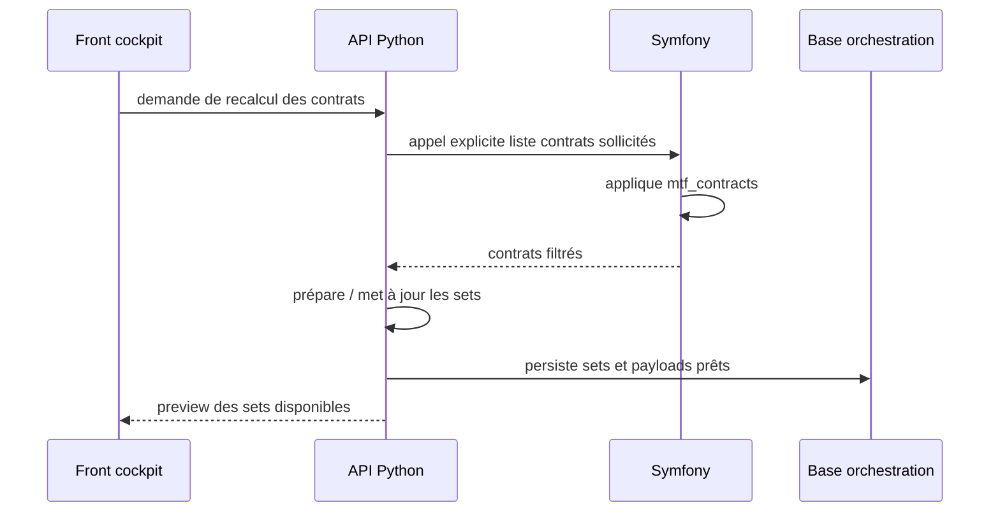

# Python orchestrator

## Statut

Cette page décrit la cible fonctionnelle retenue pour l'orchestration des appels TradingV3.

L'API Python devient l'orchestrateur principal. Temporal reste un déclencheur planifié basique et Symfony reste le moteur métier MTF.

## Objectif

Remplacer le modèle "un worker lance un gros traitement" par un modèle où l'API Python :

1. lit des sets de payloads déjà préparés ;
2. lance plusieurs appels Symfony en parallèle ;
3. garde `workers=1` côté Symfony au début ;
4. agrège les résultats ;
5. sauvegarde le dernier JSON retourné ;
6. expose une visualisation fonctionnelle au front.

Le but n'est pas d'augmenter le nombre de trades. Le but est de mieux contrôler les appels, isoler les erreurs, comparer les modes et réduire les mauvais trades.

## Responsabilités

| Composant | Rôle |
| --- | --- |
| Front cockpit | Configure les sets, force une mise à jour des contrats, déclenche un run, visualise le dernier JSON. |
| API Python | Orchestre, parallélise, agrège, persiste les sets et les résultats. |
| Symfony | Fournit la liste des contrats sollicités, exécute `/api/mtf/run`, conserve la logique métier trading. |
| Temporal | Déclenche périodiquement `/orchestrator/run` et reçoit OK / non OK. |
| PostgreSQL | Stocke la configuration d'orchestration, les sets prêts, les runs et le dernier JSON. |

## Flux fonctionnel principal



### Snapshot d'état ouvert partagé (SF-002b)

Pour éviter un appel exchange par set, l'orchestrateur récupère l'état ouvert
(positions/ordres) **une seule fois par couple `(exchange, market_type)` distinct**
parmi les sets `mtf_run` actifs, via `GET /api/exchange/open-state`, puis transmet
ce snapshot à chaque `POST /api/mtf/run` dans le champ `open_state_snapshot` avec
`sync_tables=false`. Côté Symfony, la présence du snapshot **court-circuite**
totalement le fetch exchange (priorité : snapshot > `sync_tables=true` > filtre).

**Fail-closed live** : si le fetch du snapshot échoue pour un couple, les sets
**live** (`dry_run=false`) de ce couple sont marqués en erreur et **ne sont pas
exécutés** (on ne trade pas à l'aveugle). Les sets **dry-run** peuvent continuer
sans snapshot. Ce garde-fou côté orchestrateur est doublé côté Symfony :
`MtfRunnerService` rejette tout run live dépourvu de source d'état ouvert fiable
(pas de snapshot ET `sync_tables=false` ET `skip_open_state_filter=true`).

## Mise à jour des contrats

La récupération des contrats depuis Symfony ne se fait pas à chaque run.

Elle se fait uniquement lors d'un changement de configuration ou via une action explicite du front.



## API Symfony : contrats sélectionnés (SF-001)

Symfony expose la liste des contrats réellement retenus par `mtf_contracts`, sans
déclencher de run, via :

```text
GET|POST /api/mtf/selected-contracts
```

Paramètres (query string en GET, JSON en POST) :

- `profile` / `mtf_profile` : profil de configuration (défaut = mode TradeEntry actif) ;
- `exchange` / `market_type` : contexte exchange (même jeu accepté que `/api/mtf/run` :
  `bitmart`, `okx`, `hyperliquid`, ... ; défaut `bitmart` / `perpetual`) ;
- `ignore_limits` : `true` pour obtenir tous les symboles éligibles sans `top_n` / `mid_n`
  (filtres strictement identiques à la sélection limitée).

Comportements explicites :

- un corps POST JSON invalide renvoie `400` (pas de bascule silencieuse sur les défauts) ;
- un `exchange` / `market_type` non supporté renvoie `400` ;
- si le fichier de config dédié au profil n'existe pas, le provider retombe sur la config
  par défaut : la réponse distingue alors `requested_profile`, `effective_profile`
  (`default`) et `profile_config_found` ;
- si `selection.enabled` vaut `false`, aucune sélection curée n'est exposée :
  `symbols` est vide et `selection_enabled` vaut `false` ;
- le `timestamp` est au format RFC3339 UTC ;
- en cas d'erreur interne, le message reste générique (les détails vont dans les logs).

Réponse type :

```json
{
  "status": "success",
  "data": {
    "requested_profile": "scalper_micro",
    "effective_profile": "scalper_micro",
    "profile_config_found": true,
    "exchange": "bitmart",
    "market_type": "perpetual",
    "selection_enabled": true,
    "ignore_limits": false,
    "count": 2,
    "symbols": ["BTCUSDT", "ETHUSDT"],
    "filters": { "quote_currency": "USDT", "status": "Trading", "min_turnover": 1500000 },
    "limits": { "top_n": 140, "mid_n": 0 },
    "timestamp": "2026-06-16T19:30:00+00:00"
  }
}
```

C'est cet endpoint que l'API Python appelle lors du refresh explicite des contrats
pour préparer ses sets de payloads.

## Lien avec `mtf_contracts`

Symfony reste la source de vérité pour la sélection initiale des contrats. La configuration `mtf_contracts` filtre déjà les contrats selon :

- activation de la sélection ;
- devise de cotation ;
- statut du contrat ;
- turnover 24h minimal ;
- séparation TOP / MID ;
- limite `top_n` ;
- limite `mid_n`.

L'évolution fonctionnelle attendue est d'ajouter une notion de quotas ou de répartition par exchange, profil, environnement ou set.

Exemples fonctionnels :

```text
Bitmart regular live        -> 30 contrats
Bitmart scalper live        -> 20 contrats
OKX regular dry-run         -> 20 contrats
Hyperliquid regular dry-run -> 20 contrats
Scalper micro               -> 10 contrats
```

## Sets de payloads

Un set est une unité fonctionnelle prête à être exécutée.

Un set peut représenter :

- un exchange ;
- un profil MTF ;
- un environnement ;
- une liste de contrats ;
- une action ;
- un niveau de priorité ;
- un statut `enabled` / `disabled` ;
- un mode `dry_run` / live.

Exemple fonctionnel cible :

```json
{
  "set_id": "bitmart_regular_live_top_30",
  "enabled": true,
  "action": "mtf_run",
  "exchange": "bitmart",
  "market_type": "perpetual",
  "mtf_profile": "regular",
  "environment": "mainnet",
  "dry_run": false,
  "workers": 1,
  "sync_tables": false,
  "symbols": ["BTCUSDT", "ETHUSDT"],
  "priority": 10
}
```

Au moment du run, l'API Python ne recalcule pas ce set. Elle le lit, l'exécute, puis sauvegarde le résultat.

## Dépendance Symfony : `sync_tables=false`

Pour que le modèle "sets déjà prêts" fonctionne, Symfony doit pouvoir exécuter `/api/mtf/run` sans relancer une synchronisation des tables exchange/open-state à chaque appel.

La cible fonctionnelle est :

```text
refresh explicite des contrats
→ sets préparés
→ runs parallèles avec sync_tables=false
```

Donc une PR technique devra faire accepter et respecter un champ équivalent à :

```json
{
  "sync_tables": false
}
```

Règles attendues :

- `sync_tables=true` reste le comportement legacy par défaut ;
- `sync_tables=false` est utilisé uniquement par l'orchestrateur Python sur des sets déjà préparés ;
- si Symfony ne sait pas encore honorer `sync_tables=false`, les runs parallèles ne doivent pas être considérés comme prêts pour la cible ;
- le front doit distinguer "refresh contrats" et "run des sets".

Sans ce contrat, chaque set pourrait encore déclencher une sync Symfony, ce qui annulerait le bénéfice du flux de refresh explicite.

> ⚠️ **Portée de `sync_tables=false` seul (SF-002a).** `sync_tables=false` saute
> uniquement l'upsert DB ; le filtre d'activité peut encore appeler l'exchange.
> Le vrai mode « zéro appel exchange par set » est livré par **SF-002b** via le
> snapshot orchestrateur ci-dessous.

## Endpoint Symfony : état ouvert (SF-002b)

```text
GET /api/exchange/open-state?exchange=bitmart&market_type=perpetual
```

Endpoint **en lecture seule** qui produit l'instantané d'état ouvert que
l'orchestrateur récupère une seule fois puis distribue à tous les sets. Réponse :

```json
{
  "open_positions": [ { "symbol": "BTCUSDT", "side": "long", "size": "1.5", "...": "..." } ],
  "open_orders":    [ { "symbol": "ETHUSDT", "order_id": "...", "side": "buy", "...": "..." } ]
}
```

- `exchange` / `market_type` : optionnels (défauts `bitmart` / `perpetual`), même
  jeu accepté que `/api/mtf/run` ; une valeur invalide renvoie `400`.
- L'orchestrateur joint ce JSON tel quel dans `open_state_snapshot` du payload
  `/api/mtf/run` (avec `sync_tables=false`).

## Déclenchement

L'endpoint cible est :

```text
POST /orchestrator/run
```

Il doit :

1. créer un `run_id` ;
2. lire les sets actifs ;
3. appliquer les garde-fous fonctionnels ;
4. lancer les appels en parallèle avec concurrence bornée ;
5. attendre tous les résultats ;
6. agréger ;
7. sauvegarder le dernier JSON ;
8. retourner un statut court.

## Réponse minimale

```json
{
  "ok": false,
  "run_id": "run_20260616_001",
  "status": "partial_failure",
  "summary": {
    "total_calls": 6,
    "success": 5,
    "failed": 1
  }
}
```

Le front peut ensuite récupérer le détail complet depuis l'API Python.

## Dernier JSON retourné

L'API Python garde toujours :

- le dernier JSON global du run ;
- le dernier JSON par set ;
- les payloads envoyés ;
- les réponses Symfony brutes ;
- le résumé affichable ;
- les erreurs.

Le front peut donc afficher le même type de retour que le retour existant de Symfony, avec une vue supplémentaire par set.

## Schéma de persistance (DB-001)

La persistance est implémentée dans `python-orchestrator/` avec **SQLAlchemy 2.0 + Alembic**
(driver `psycopg` sync). Les tables vivent dans un **schéma PostgreSQL dédié `orchestration`**
au sein de la base `trading_app` existante, afin de ne pas interférer avec les migrations
Doctrine de Symfony (qui n'introspecte que `public`).

| Table | Rôle |
| --- | --- |
| `dashboards` | Configurations d'orchestration (nom, statut actif). |
| `orchestration_sets` | Sets prêts à exécuter (miroir d'`OrchestratorSet`, dont `sync_tables`, `symbols`, `contracts_limit`, et le `payload` préparé). |
| `runs` | Runs déclenchés (`run_id`, statut, compteurs, idempotency_key) + **dernier JSON global** (`last_json`). |
| `run_sets` | Détail par set d'un run (payload envoyé, réponse Symfony, statut, erreur, durée) + **dernier JSON par set** (`response_json`). |

DB-001 ne livre que la couche schéma (modèles, migration, moteur/session, repositories).

**PY-002** câble la couche DB dans une API REST de **configuration** des dashboards et des
sets (CRUD), sous le préfixe `/dashboards` :

| Méthode | Chemin | Rôle |
| --- | --- | --- |
| `GET` / `POST` | `/dashboards` | Liste / crée un dashboard. |
| `GET` / `PATCH` / `DELETE` | `/dashboards/{id}` | Détail / mise à jour partielle / suppression. |
| `GET` / `POST` | `/dashboards/{id}/sets` | Liste (`?enabled_only=true`) / crée un set. |
| `GET` / `PATCH` / `DELETE` | `/dashboards/{id}/sets/{set_id}` | Détail / mise à jour / suppression d'un set. |

Garde-fous appliqués dès la configuration (revalidés sur les `PATCH` partiels) : borne `workers` ;
**aucun live persistable** (`dry_run=false` refusé pour tous les exchanges/environnements tant que
la readiness live n'est pas livrée) ; **sélection exploitable obligatoire** (`symbols` non vide ou
`contracts_limit`) ; **`payload` non writable** (produit serveur PY-004, lecture seule) ; rejet des
`null` explicites sur les champs NOT NULL ; unicité du nom de dashboard et du `set_id` par dashboard
(`409`) ; `set_id` immuable.

La **lecture des sets persistés au moment du run** et l'**écriture des runs** restent portées par
**PY-005** (`/orchestrator/run` lit encore les sets simulés). Les migrations s'appliquent via
`alembic upgrade head` (voir `python-orchestrator/README.md`).

## Garde-fous fonctionnels

Avant tout run :

- ne jamais lancer deux sets live incompatibles sur le même symbole ;
- ne pas autoriser OKX live ;
- ne pas autoriser Hyperliquid live ;
- garder `workers=1` côté Symfony au début ;
- borner la concurrence globale ;
- refuser les valeurs dangereuses de workers, concurrence ou nombre de contrats ;
- exiger une API Symfony exposant les contrats filtrés par `mtf_contracts` avant de persister des sets réels ;
- exiger le support Symfony de `sync_tables=false` avant d'utiliser des sets préparés en parallèle ;
- conserver une trace du dernier payload et de la dernière réponse ;
- ne pas déclencher des trades simplement pour augmenter la fréquence.

## Plan court de PR atomiques

| PR | Objectif | Résultat attendu |
| --- | --- | --- |
| DOC-001 | Figer la cible fonctionnelle | Documentation actuelle validée. |
| SF-001 ✅ | Exposer les contrats filtrés par `mtf_contracts` | Livré : `GET /api/mtf/contracts` retourne les symboles réellement sélectionnés. |
| PY-001 | Créer le squelette API Python | Service API lancé, endpoint healthcheck, structure projet. |
| DB-001 | Persister dashboards, sets et derniers runs | Tables orchestration + dernier JSON global/par set. |
| SF-002a ✅ | Supporter `sync_tables=false` côté Symfony | Livré : `/api/mtf/run` et `mtf:run` honorent `sync_tables=false` (skip upsert DB). |
| SF-002b ✅ | Snapshot d'état ouvert orchestrateur (zéro appel exchange par set) | Livré : `GET /api/exchange/open-state` + `open_state_snapshot` sur `/api/mtf/run` ; fail-closed live côté Symfony et orchestrateur. |
| PY-002 ✅ (partiel) | Implémenter `/orchestrator/run` | Livré : lecture des sets actifs, fetch snapshot 1×/(exchange,market_type), appels parallèles bornés, agrégation, fail-closed live. Persistance DB du dernier JSON à compléter. |
| UI-001 | Ajouter cockpit minimal | Liste des sets, preview, dernier JSON, erreurs par set. |
| TM-001 | Brancher Temporal en cron basique | Une activity appelle `/orchestrator/run` et échoue si `ok=false`. |

Ce plan reste volontairement court. Les issues et prompts détaillés seront créés au moment de chaque PR.

## Endpoint contrats filtrés (SF-001)

`GET /api/mtf/contracts` expose, en lecture seule, les symboles sélectionnés par
`mtf_contracts`. Il réutilise le même chemin que le runner
(`ContractRepository::allActiveSymbolNames`) sans consommer la file MTF switch.

Paramètres de requête (tous optionnels) :

| Param | Alias | Défaut | Rôle |
| --- | --- | --- | --- |
| `profile` | `mtf_profile` | 1er mode activé, sinon config fallback | Profil de configuration `mtf_contracts.<profile>.yaml`. |
| `exchange` | `cex` | `bitmart` | Exchange ciblé. |
| `market_type` | `type_contract` | `perpetual` | Type de marché. |

Réponse :

```json
{
  "ok": true,
  "profile": "scalper_micro",
  "exchange": "bitmart",
  "market_type": "perpetual",
  "count": 42,
  "symbols": ["BTCUSDT", "ETHUSDT"],
  "filters": {
    "quote_currency": "USDT",
    "status": "Trading",
    "min_turnover": 1500000,
    "mid_max_turnover": 8000000,
    "top_n": 140,
    "mid_n": 0
  }
}
```

L'API Python utilise cet endpoint lors du « refresh contrats » pour préparer les sets.

## Hors-scope de la première PR code

La première PR technique de l'API Python ne doit pas encore gérer tout le trading live.

Elle peut se limiter à :

- squelette API ;
- endpoint `/orchestrator/run` ;
- lecture de sets persistés ou simulés ;
- appels parallèles dry-run ;
- stockage du dernier JSON ;
- visualisation minimale.

Le live orchestré nécessite une étape dédiée avec idempotence, locks, support `sync_tables=false` et validation côté Symfony.
