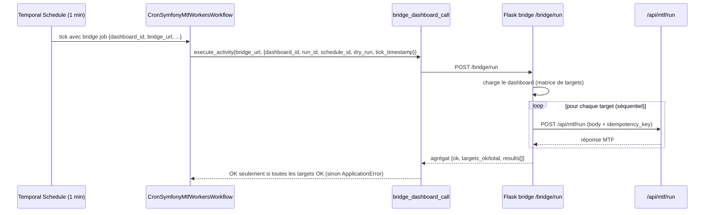

# Temporal bridge dashboard

## Statut

PR13 formalise le scheduling Temporal via une **API Python/Flask « bridge »** entre Temporal et
Symfony. Le bridge lit un **dashboard** (matrice d'exécution : plusieurs `targets`), effectue des
appels `POST /api/mtf/run` **séquentiels** vers Symfony, agrège les réponses et ne renvoie OK que
si **toutes** les targets sont OK.

Le flux historique (un job direct par schedule) reste **inchangé** : le routage est **additif**.
OKX et Hyperliquid restent `dry-run only` (PR11/PR12) ; `mainnet` n'est qu'un réseau, jamais une
autorisation live.

Cette page complète :

- `technical/temporal.md` (worker, workflow, activité legacy, schedules) ;
- `technical/exchange-schedule-policy.md` (politique des schedules par exchange) ;
- `technical/exchange-runtime-gates.md` (gates avant tout live).

## Flux cible



## Format du dashboard

Fichier YAML (voir `cron_symfony_mtf_workers/bridge/dashboards.example.yaml`) :

```yaml
dashboards:
  - dashboard_id: okx-hl-dry-run
    cadence: "*/1 * * * *"
    fail_policy: continue          # ou fail_fast
    targets:
      - target_id: okx-demo-scalper
        exchange: okx
        network: demo              # informational uniquement
        market_type: perpetual
        mtf_profile: scalper
        dry_run: true
        workers: 4
      - target_id: hyperliquid-mainnet-regular
        exchange: hyperliquid
        network: mainnet           # network != live
        market_type: perpetual
        mtf_profile: regular
        dry_run: true
        workers: 4
```

### Champs dashboard

| Champ | Défaut | Description |
| --- | --- | --- |
| `dashboard_id` | requis | Identifiant unique de la matrice. |
| `cadence` | `*/1 * * * *` | Expression cron du schedule Temporal. |
| `fail_policy` | `continue` | `continue` (appelle toutes les targets puis agrège) ou `fail_fast` (stoppe à la 1re erreur). |
| `targets` | requis (≥1) | Liste des targets. |

### Champs target

| Champ | Défaut | Description |
| --- | --- | --- |
| `target_id` | requis | Identifiant unique dans le dashboard. |
| `exchange` | requis | `bitmart`, `okx`, `hyperliquid`, `fake`, … |
| `market_type` | `perpetual` | `perpetual` ou `spot`. |
| `mtf_profile` | `null` | `regular`, `scalper`, `scalper_micro`. |
| `network` | `null` | `demo` / `testnet` / `mainnet` — **informational/audit uniquement**, jamais envoyé à Symfony. |
| `dry_run` | `true` | Mode dry-run. OKX/Hyperliquid : doit rester `true`. |
| `workers` | `4` | Workers runner côté Symfony. |
| `url` | `http://trading-app-nginx:80/api/mtf/run` | Endpoint Symfony cible. |
| `symbols` | `null` | Liste optionnelle de symboles. |
| `force_run` | `false` | Ignore certains garde-fous de cadence. |

Le **body Symfony** produit par une target reprend exactement les clés de `MtfJob.payload()`
(`workers, dry_run, force_run, exchange, market_type, mtf_profile?, symbols?`) **plus**
`idempotency_key`. `network` n'est jamais inclus dans ce body.

## Payload Temporal → bridge

Le schedule transmet un **bridge job** mince à l'activité :

```json
{ "dashboard_id": "okx-hl-dry-run", "bridge_url": "http://mtf-bridge:8090/bridge/run",
  "schedule_id": "cron-mtf-dashboard-okx-hl-dry-run-1m", "dry_run": true }
```

L'activité `bridge_dashboard_call` poste vers le bridge :

```json
{ "dashboard_id": "okx-hl-dry-run", "run_id": "<temporal run id>",
  "schedule_id": "cron-mtf-dashboard-okx-hl-dry-run-1m", "dry_run": true,
  "tick_timestamp": "2026-06-16T00:01:00+00:00" }
```

Temporal **n'appelle pas** plusieurs endpoints Symfony directement : le bridge est responsable de la
matrice.

## Comportement du bridge

- lit le dashboard par `dashboard_id` (404 si inconnu, 400 si `dashboard_id` manquant) ;
- appelle Symfony **target par target, séquentiellement**, en attendant chaque réponse ;
- agrège : `ok = toutes les targets OK`, plus `targets_total`, `targets_called`, `targets_ok`,
  `results[]` (détail par target : `ok`, `status`, `summary`, `error`, `idempotency_key`, …) ;
- HTTP `200` si `ok`, sinon `502` avec le détail ;
- `fail_policy=fail_fast` stoppe à la première erreur ; `continue` (défaut) appelle toutes les targets.

## Idempotence

Chaque target reçoit une clé stable :

```
idempotency_key = dashboard_id:target_id:tick_timestamp
```

`tick_timestamp` est dérivé de `workflow.now()` (déterministe) : un retry Temporal de la même tick
réutilise la **même** clé. La clé est transmise dans le body Symfony pour permettre une déduplication
côté Symfony.

> **Limite (PR13)** : le bridge est *stateless* (aucune persistance). La déduplication réelle suppose
> que Symfony honore `idempotency_key`. Sur retry Temporal en `fail_policy=continue`, les targets déjà
> OK sont rappelées : c'est précisément la clé stable qui doit éviter les doubles effets en aval.

## Garde dry-run-only (OKX / Hyperliquid)

`Dashboard.validate_policy()` réutilise `assert_exchange_schedule_policy` (PR11/PR12, casing-proof) :

- un dashboard avec une target `okx`/`hyperliquid` en `dry_run=false` est **refusé** au **chargement**
  (fail-closed), à l'**exécution** (`run_dashboard`) et à la **création** de schedule ;
- Bitmart legacy peut toujours tourner live ; seules OKX/Hyperliquid sont bloquées ;
- les dashboards d'exemple livrés sont **tous** `dry_run=true`.

## Réécriture Temporal (additive)

- `workflows/mtf_workers.py` : un job contenant `dashboard_id` → chemin bridge
  (`bridge_dashboard_call`) ; sinon → chemin legacy `MtfJob` **inchangé** (Bitmart legacy intact).
- `activities/bridge_http.py` : `bridge_dashboard_call` poste vers le bridge et **lève**
  `ApplicationError` si l'agrégat n'est pas `ok` (Temporal voit l'échec).
- `worker.py` : enregistre `mtf_api_call` **et** `bridge_dashboard_call`.

## Créer un schedule dashboard

```bash
python scripts/manage_dashboard_schedule.py create --dashboard-id okx-hl-dry-run
python scripts/manage_dashboard_schedule.py create --dashboard-id okx-hl-dry-run --dry-run-schedule  # preview
python scripts/manage_dashboard_schedule.py status --dashboard-id okx-hl-dry-run
python scripts/manage_dashboard_schedule.py pause  --schedule-id cron-mtf-dashboard-okx-hl-dry-run-1m
python scripts/manage_dashboard_schedule.py delete --schedule-id cron-mtf-dashboard-okx-hl-dry-run-1m
```

IDs générés : `cron-mtf-dashboard-{dashboard_id}-{cadence}` et `mtf-dashboard-{dashboard_id}-runner`.
La création valide la politique dry-run-only avant tout contact Temporal.

## Conteneur

Le service `mtf-bridge` (docker-compose) réutilise l'image du worker avec
`entrypoint: ["python","-m","bridge.app"]`, expose `BRIDGE_PORT` (8090) et lit
`BRIDGE_DASHBOARDS_PATH`. Le worker reçoit `BRIDGE_URL=http://mtf-bridge:8090/bridge/run`.

```bash
docker compose up -d mtf-bridge cron-symfony-mtf-workers
```

## Hors-scope PR13

- aucun live OKX / Hyperliquid ; aucun mainnet trading ;
- aucun bundle provider OKX/Hyperliquid runtime MTF ; aucun branchement TradeEntry ;
- aucun changement stratégie, EntryZone, Risk/Leverage, SL-TP ; aucun analytics ; aucun backtesting ;
- aucune suppression Bitmart ; aucun secret (le `dashboards.example.yaml` ne contient que
  exchange/profile/mode) ;
- les gates PR11/PR12 ne sont **pas** modifiées : elles sont réutilisées.

## Tests

Depuis `cron_symfony_mtf_workers/` :

```bash
pytest tests/test_bridge_dashboard.py        # modèle + garde dry-run-only
pytest tests/test_bridge_runner.py           # orchestration séquentielle + agrégation + fail_policy
pytest tests/test_bridge_app.py              # adaptateur Flask (test client)
pytest tests/test_manage_dashboard_schedule.py
pytest tests/test_mtf_job.py                 # idempotency_key
```
