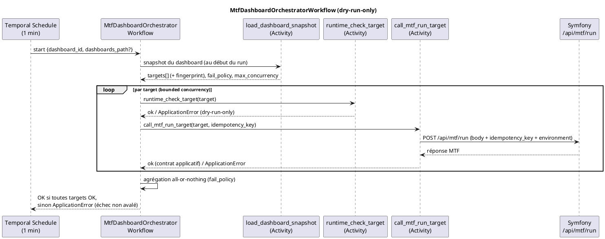

# Temporal dashboard orchestrator

## Statut

PR13 (voie 1) formalise le scheduling Temporal **dans le Workflow Python**, sans bridge Flask.
Un seul schedule démarre `MtfDashboardOrchestratorWorkflow`, qui lit un **snapshot** de dashboard
(matrice de `targets`) et exécute **une Activity Temporal par target** avec retry, timeout et
visibilité par target, en **bounded concurrency**, puis agrège **all-or-nothing**.

**Le dashboard orchestrator est `dry-run-only` pour tous les exchanges.** Symfony ne consomme pas
encore `environment` / `idempotency_key` (pas de pilotage demo/mainnet réel, pas de déduplication),
et le worker Python ne peut pas exécuter de runtime-check live ; le **trading live reste sur le
schedule *direct* legacy** (`manage_exchange_profile_schedule.py`), inchangé. Une target dashboard
en `dry_run=false` est donc refusée (au snapshot, au runtime-check et à la création de schedule).

Le chemin direct historique (`CronSymfonyMtfWorkersWorkflow` → `mtf_api_call`) reste **inchangé**
(Bitmart legacy intact). OKX/Hyperliquid restent `dry-run only` (PR11/PR12).

Cette page complète :

- `technical/temporal.md` (worker, workflows, activités, schedules) ;
- `technical/exchange-schedule-policy.md` (politique des schedules par exchange) ;
- `technical/exchange-runtime-gates.md` (gates avant tout live).

## Flux cible



## Pourquoi pas de bridge Flask

L'orchestration vit dans le Workflow Temporal, pas dans un service HTTP opaque :

- chaque target est une **Activity** → retry, timeout et logs **par target**, visibles dans Temporal ;
- **bounded concurrency** native (pas d'appels séquentiels bloquants) ;
- pas de port HTTP exposé, pas de serveur Flask de dev, pas de surface SSRF ;
- un échec de target **ne peut pas être avalé** : le Workflow lève si l'agrégat n'est pas OK.

## Format du dashboard

Fichier YAML (template : `cron_symfony_mtf_workers/dashboards/dashboards.example.yaml`). C'est la
source lue par `load_dashboard_snapshot` au début de **chaque** run (pas de matrice obsolète).
`DASHBOARDS_PATH` pointe vers la vraie config (`dashboards/dashboards.yaml`, **gitignored**) ; on la
crée en copiant le template. Un fichier absent = aucun run dashboard servi (le schedule direct
legacy n'est pas affecté).

```yaml
dashboards:
  - dashboard_id: okx-hl-dry-run
    cadence: "*/1 * * * *"
    fail_policy: continue          # ou fail_fast (séquentiel, stoppe à la 1re erreur)
    max_concurrency: 2             # cap dur: 8
    targets:
      - target_id: okx-demo-scalper
        exchange: okx
        environment: demo           # demo|testnet|mainnet (validé) ; pas du live
        market_type: perpetual
        mtf_profile: scalper
        dry_run: true               # obligatoire: dashboard dry-run-only
        workers: 4                  # cap dur: 16
```

### Champs dashboard

| Champ | Défaut | Description |
| --- | --- | --- |
| `dashboard_id` | requis | Identifiant unique. |
| `cadence` | `*/1 * * * *` | Expression cron du schedule. |
| `fail_policy` | `continue` | `continue` (lance toutes les targets en batches puis agrège) ou `fail_fast` (**séquentiel**, stoppe à la 1re target en échec). |
| `max_concurrency` | `4` | Activities target simultanées. **Cap dur : 8** (dépassement refusé). |
| `targets` | requis (≥1) | Liste des targets. |

### Champs target

| Champ | Défaut | Description |
| --- | --- | --- |
| `target_id` | requis | Identifiant unique dans le dashboard. |
| `exchange` | requis | `bitmart`, `okx`, `hyperliquid`, … |
| `market_type` | `perpetual` | `perpetual` ou `spot`. |
| `mtf_profile` | `null` | `regular`, `scalper`, `scalper_micro`. |
| `environment` | `null` | `demo`/`testnet`/`mainnet` (**validé** contre cette liste fermée). Alias accepté : `network`. **Non encore consommé par Symfony** (voir Limites). |
| `dry_run` | `true` | **Doit être `true`** : le dashboard est dry-run-only. |
| `workers` | `4` | Workers runner côté Symfony. **Cap dur : 16** (dépassement refusé). |
| `symbols` | `null` | Liste optionnelle de symboles. |
| `force_run` | `false` | Ignore certains garde-fous de cadence. |

> Pas de champ `url` par target : l'endpoint Symfony est résolu depuis `MTF_WORKERS_URL` dans
> l'Activity (source unique, aucune URL arbitraire → pas de surface SSRF).

## Activities

| Activity | Rôle |
| --- | --- |
| `load_dashboard_snapshot(dashboard_id, dashboards_path?)` | Charge un snapshot frais ; valide dry-run-only (fail-closed). Erreurs de config déterministes → `ApplicationError(non_retryable=True)`. |
| `runtime_check_target(target)` | Garde **dry-run-only** par target (defense in depth). Aucun Docker, aucun runtime-check live. Une target live → `ApplicationError(non_retryable=True)`. |
| `call_mtf_run_target(target, idempotency_key)` | POST d'**une** target vers Symfony ; succès selon le **contrat applicatif**. |

## Contrat de succès applicatif & retry

`call_mtf_run_target` ne considère pas une target OK sur simple HTTP 2xx :

- requis : HTTP 2xx **et** body JSON objet **et** top-level `status == "success"` (si présent) **et**
  `success != false` **et** pas de `data.errors` non vide ;
- un 2xx **non-JSON** (page HTML proxy, vide, « OK ») est **fail-closed** (échec) ;
- les statuts ERROR par symbole dans les résultats ne sont pas comptés comme échec du run.

Retry par target (`RetryPolicy`) discriminé :

- transport / timeout / `429` / `5xx` → `ApplicationError` **retryable** (transitoire) ;
- échec applicatif déterministe (`status: error`, `success=false`, `data.errors`) ou `4xx` →
  `ApplicationError(non_retryable=True)` (le retry ne corrigerait rien).

## Idempotence

Clé stable par target : `dashboard_id:target_id:tick_timestamp:fingerprint`.

- `tick_timestamp` dérive de `workflow.now()` (déterministe) → identique aux replays/retries ;
- `fingerprint` est un hash de la **config effective** de la target → un changement de config
  (même `target_id`) produit une clé différente, évitant une collision de payload obsolète ;
- une Activity par target → un retry ne rejoue **que** cette target.

## Bounded concurrency & all-or-nothing

`continue` exécute les targets par batches de `max_concurrency` puis agrège. `fail_fast` s'exécute
**séquentiellement** (concurrency effective 1) et stoppe à la première target en échec. Le run est
OK **uniquement** si toutes les targets ont été appelées et ont réussi ; sinon le Workflow lève
`ApplicationError` (échec visible dans Temporal, jamais avalé). Le détail structuré par target reste
dans l'historique de chaque Activity.

## Créer un schedule dashboard

```bash
python scripts/manage_dashboard_schedule.py create --dashboard-id okx-hl-dry-run
python scripts/manage_dashboard_schedule.py create --dashboard-id okx-hl-dry-run --dry-run-schedule
python scripts/manage_dashboard_schedule.py status --dashboard-id okx-hl-dry-run
python scripts/manage_dashboard_schedule.py delete --schedule-id cron-mtf-dashboard-okx-hl-dry-run-1m
```

IDs générés : `cron-mtf-dashboard-{dashboard_id}-{cadence}` et `mtf-dashboard-{dashboard_id}-runner`.
La création valide la politique dry-run-only avant tout contact Temporal (un dashboard contenant une
target live est refusé à la création) ; la cadence vient du dashboard.

## Limites (PR13) — pas de fausse sécurité

- **`environment` et `idempotency_key` ne sont pas encore consommés par `/api/mtf/run`** : le
  contrôleur Symfony / `MtfRunnerRequestDto` ne les relaie pas. Donc demo/testnet/mainnet n'est PAS
  réellement piloté et la déduplication n'existe PAS côté Symfony aujourd'hui. Ces champs sont
  transmis pour forward-compat / audit. **C'est pourquoi le dashboard reste dry-run-only** : autoriser
  du live via dashboard exigerait d'abord le support PHP (`environment` + `idempotency_key` + dédup),
  dans une PR dédiée.
- Le live de trading reste exclusivement sur le **schedule direct legacy**
  (`manage_exchange_profile_schedule.py`), qui conserve son runtime-check de création.
- La source dashboard est un fichier YAML (`DASHBOARDS_PATH`) ; un cockpit/DB pourra remplacer la
  source du snapshot ultérieurement sans changer le Workflow.

## Hors-scope PR13

- aucun live OKX / Hyperliquid ; aucun mainnet trading ; aucun live via dashboard ;
- aucun bundle provider OKX/HL runtime MTF ; aucun branchement TradeEntry ;
- aucun changement stratégie, EntryZone, Risk/Leverage, SL-TP ; aucun analytics ; aucun backtesting ;
- aucune suppression Bitmart ; aucun secret ;
- aucune modification Symfony/PHP (le support `environment`/`idempotency_key` est une PR ultérieure) ;
- les gates PR11/PR12 ne sont **pas** modifiées : elles sont réutilisées.

## Tests

Depuis `cron_symfony_mtf_workers/` (exécutés en CI via `.github/workflows/cron-workers-tests.yml`) :

```bash
pytest tests/test_dashboard_model.py        # parsing, caps, dry-run-only, fingerprint, snapshot
pytest tests/test_dashboard_runtime.py      # contrat de succès, transient HTTP, dry-run-only guardrail
pytest tests/test_dashboard_orchestrate.py  # batching, bounded concurrency, fail_fast séquentiel
pytest tests/test_dashboard_activities.py   # wrappers Activities (httpx mocké, retry transient vs déterministe)
pytest tests/test_manage_dashboard_schedule.py
```
