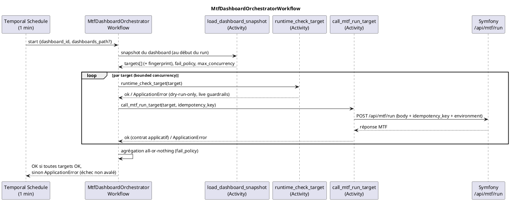

# Temporal dashboard orchestrator

## Statut

PR13 (voie 1) formalise le scheduling Temporal **dans le Workflow Python**, sans bridge Flask.
Un seul schedule démarre `MtfDashboardOrchestratorWorkflow`, qui lit un **snapshot** de dashboard
(matrice de `targets`) et exécute **une Activity Temporal par target** avec retry, timeout et
visibilité par target, en **bounded concurrency**, puis agrège **all-or-nothing**.

Le chemin direct historique (`CronSymfonyMtfWorkersWorkflow` → `mtf_api_call`) reste **inchangé**
(Bitmart legacy intact). OKX/Hyperliquid restent `dry-run only` (PR11/PR12) ; `environment`
(`demo`/`testnet`/`mainnet`) est une dimension de configuration, jamais une autorisation live.

Cette page complète :

- `technical/temporal.md` (worker, workflows, activités, schedules) ;
- `technical/exchange-schedule-policy.md` (politique des schedules par exchange) ;
- `technical/exchange-runtime-gates.md` (gates avant tout live).

## Flux cible



## Pourquoi pas de bridge Flask

L'orchestration vit dans le Workflow Temporal, pas dans un service HTTP opaque :

- chaque target est une **Activity** → retry, timeout et logs **par target**, visibles dans Temporal ;
- **bounded concurrency** native (pas d'appels séquentiels bloquants) ;
- pas de port HTTP exposé, pas de serveur Flask de dev, pas de surface SSRF ;
- un échec de target **ne peut pas être avalé** : le Workflow lève si l'agrégat n'est pas OK.

## Format du dashboard

Fichier YAML (template : `cron_symfony_mtf_workers/dashboards/dashboards.example.yaml`). C'est la
source lue par `load_dashboard_snapshot` au début de **chaque** run (pas de matrice obsolète) ;
`DASHBOARDS_PATH` doit pointer vers la vraie config en prod.

```yaml
dashboards:
  - dashboard_id: okx-hl-dry-run
    cadence: "*/1 * * * *"
    fail_policy: continue          # ou fail_fast
    max_concurrency: 2
    targets:
      - target_id: okx-demo-scalper
        exchange: okx
        environment: demo           # dimension config (effective config resolver), pas du live
        market_type: perpetual
        mtf_profile: scalper
        dry_run: true
        workers: 4
      - target_id: hyperliquid-mainnet-regular
        exchange: hyperliquid
        environment: mainnet        # mainnet != live
        market_type: perpetual
        mtf_profile: regular
        dry_run: true
        workers: 4
```

### Champs dashboard

| Champ | Défaut | Description |
| --- | --- | --- |
| `dashboard_id` | requis | Identifiant unique. |
| `cadence` | `*/1 * * * *` | Expression cron du schedule. |
| `fail_policy` | `continue` | `continue` (lance toutes les targets puis agrège) ou `fail_fast` (stoppe après le batch en échec). |
| `max_concurrency` | `4` | Nombre maximum d'Activities target simultanées. |
| `targets` | requis (≥1) | Liste des targets. |

### Champs target

| Champ | Défaut | Description |
| --- | --- | --- |
| `target_id` | requis | Identifiant unique dans le dashboard. |
| `exchange` | requis | `bitmart`, `okx`, `hyperliquid`, … |
| `market_type` | `perpetual` | `perpetual` ou `spot`. |
| `mtf_profile` | `null` | `regular`, `scalper`, `scalper_micro`. |
| `environment` | `null` | `demo`/`testnet`/`mainnet` — dimension de config transmise à Symfony, **jamais** une autorisation live. Alias accepté : `network`. |
| `dry_run` | `true` | OKX/Hyperliquid : doit rester `true`. |
| `workers` | `4` | Workers runner côté Symfony. |
| `symbols` | `null` | Liste optionnelle de symboles. |
| `force_run` | `false` | Ignore certains garde-fous de cadence. |

> Pas de champ `url` par target : l'endpoint Symfony est résolu depuis `MTF_WORKERS_URL` dans
> l'Activity (source unique, aucune URL arbitraire → pas de surface SSRF).

Le body Symfony envoyé par target reprend les clés de `MtfJob.payload()`
(`workers, dry_run, force_run, exchange, market_type, mtf_profile?, symbols?`) **plus**
`environment?` et `idempotency_key`.

## Activities

| Activity | Rôle |
| --- | --- |
| `load_dashboard_snapshot(dashboard_id, dashboards_path?)` | Charge un snapshot frais ; valide la politique dry-run-only (fail-closed). |
| `runtime_check_target(target)` | dry-run → skip ; live → mêmes garde-fous que `manage_exchange_profile_schedule` (`schedule_ready`/`credentials`/`live_trading`). OKX/HL live → refus. |
| `call_mtf_run_target(target, idempotency_key)` | POST d'**une** target vers Symfony ; succès selon le **contrat applicatif** (pas seulement HTTP 2xx). |

## Contrat de succès applicatif

`call_mtf_run_target` ne considère pas une target OK sur simple HTTP 2xx : le succès exige HTTP 2xx
**et**, quand le body JSON est disponible, `success != false` **et** pas d'`data.errors` non vide.
Les statuts ERROR par symbole dans les résultats ne sont pas comptés comme échec du run (sortie MTF
normale).

## Idempotence

Clé stable par target :

```
idempotency_key = dashboard_id:target_id:tick_timestamp:fingerprint
```

- `tick_timestamp` dérive de `workflow.now()` (déterministe) → identique aux replays/retries ;
- `fingerprint` est un hash de la **config effective** de la target → un changement de config
  (même `target_id`) produit une clé différente, évitant une collision de payload obsolète ;
- une Activity par target → un retry ne rejoue **que** cette target (pas tout le batch).

La clé est transmise dans le body Symfony pour permettre une déduplication côté Symfony.

## Bounded concurrency & all-or-nothing

Les targets sont exécutées par batches de taille `max_concurrency`. En `fail_policy=continue`,
toutes les targets sont lancées puis agrégées ; en `fail_fast`, l'orchestrateur stoppe après le
premier batch contenant un échec. Le run est OK **uniquement** si toutes les targets ont été
appelées et ont réussi ; sinon le Workflow lève `ApplicationError` (échec visible dans Temporal,
jamais avalé).

## Créer un schedule dashboard

```bash
python scripts/manage_dashboard_schedule.py create --dashboard-id okx-hl-dry-run
python scripts/manage_dashboard_schedule.py create --dashboard-id okx-hl-dry-run --dry-run-schedule
python scripts/manage_dashboard_schedule.py status --dashboard-id okx-hl-dry-run
python scripts/manage_dashboard_schedule.py pause  --schedule-id cron-mtf-dashboard-okx-hl-dry-run-1m
python scripts/manage_dashboard_schedule.py delete --schedule-id cron-mtf-dashboard-okx-hl-dry-run-1m
```

IDs générés : `cron-mtf-dashboard-{dashboard_id}-{cadence}` et `mtf-dashboard-{dashboard_id}-runner`.
La création valide la politique dry-run-only avant tout contact Temporal et la cadence vient du dashboard.

## Limites (PR13)

- La source dashboard est un fichier YAML (`DASHBOARDS_PATH`) ; un cockpit/DB pourra remplacer la
  source du snapshot ultérieurement sans changer le Workflow.
- La déduplication réelle suppose que Symfony honore `idempotency_key` (transmise) ; le retry
  Temporal par target borne déjà le risque de double exécution.
- Pour une target **live**, `runtime_check_target` exécute `app:exchange:runtime-check` (le worker
  doit pouvoir l'invoquer). OKX/HL ne sont jamais live ; Bitmart live reste recommandé via le
  chemin direct legacy.

## Hors-scope PR13

- aucun live OKX / Hyperliquid ; aucun mainnet trading ;
- aucun bundle provider OKX/HL runtime MTF ; aucun branchement TradeEntry ;
- aucun changement stratégie, EntryZone, Risk/Leverage, SL-TP ; aucun analytics ; aucun backtesting ;
- aucune suppression Bitmart ; aucun secret ;
- les gates PR11/PR12 ne sont **pas** modifiées : elles sont réutilisées.

## Tests

Depuis `cron_symfony_mtf_workers/` :

```bash
pytest tests/test_dashboard_model.py        # parsing, gate dry-run-only, fingerprint, snapshot
pytest tests/test_dashboard_runtime.py      # contrat de succès, runtime-check decision, body Symfony
pytest tests/test_dashboard_orchestrate.py  # batching, bounded concurrency, fail_policy, échec => not ok
pytest tests/test_dashboard_activities.py   # wrappers Activities (httpx + runtime-check mockés)
pytest tests/test_manage_dashboard_schedule.py
```
