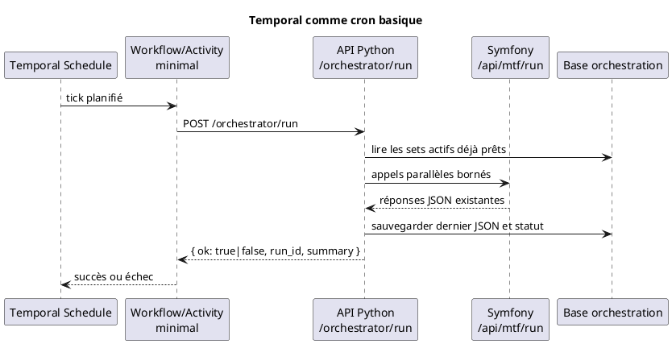
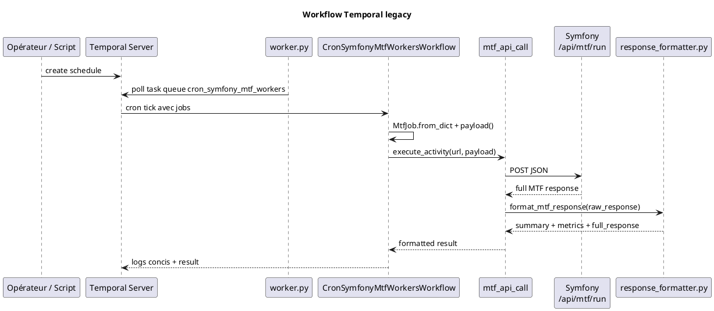

# Temporal Workers

Le sous-projet `cron_symfony_mtf_workers/` orchestre historiquement des appels planifiés vers Symfony. Il ne valide pas les signaux lui-même : il construit des jobs, démarre un workflow Temporal, appelle l'API Symfony, compacte la réponse et conserve la réponse complète dans le résultat workflow.

La cible fonctionnelle retenue pour la suite est plus simple : Temporal redevient un déclencheur planifié basique. L'orchestration parallèle, les sets de payloads, la conservation du dernier JSON et la visualisation sont portés par une API Python dédiée.

## Décision cible

| Composant | Responsabilité cible |
| --- | --- |
| Temporal schedule | Déclencher périodiquement un run. |
| Temporal workflow / activity | Appeler une URL unique de l'orchestrateur Python et retourner OK / non OK. |
| API Python orchestratrice | Lire les sets prêts, lancer les appels Symfony en parallèle, agréger, persister le dernier JSON. |
| Symfony / TradingV3 | Rester le moteur métier : `/api/mtf/run`, `/api/mtf/sync-contracts`, configuration `mtf_contracts`. |
| Front cockpit | Paramétrer les sets, lancer un run manuel, visualiser le dernier retour JSON. |

Cette décision évite de faire porter à Temporal la logique de sélection, de découpage, de concurrence et d'audit des appels. Temporal reste utile comme cron supervisé, mais ne devient pas le moteur d'orchestration trading.

## Flux cible simplifié



## Responsabilités legacy

| Composant | Fichier | Rôle |
| --- | --- | --- |
| Worker process | `cron_symfony_mtf_workers/worker.py` | Se connecte à Temporal, enregistre workflow et activity sur la task queue. |
| Workflow legacy | `workflows/mtf_workers.py` | Normalise les jobs, exécute `mtf_api_call`, logge le résumé. |
| Activity HTTP legacy | `activities/mtf_http.py` | POST JSON vers Symfony, parse la réponse, appelle le formatter. |
| Model job | `models/mtf_job.py` | Normalise URL, workers, dry-run, profile, exchange, market type, timeout et symboles. |
| Formatter | `utils/response_formatter.py` | Réduit une réponse MTF longue en résumé exploitable. |
| Schedules | `scripts/manage_*.py` | Crée, lit, pause, reprend ou supprime les schedules. |
| Tests | `tests/*.py` | Valide le formatter et les helpers de schedules. |

## Flux legacy actuel



## Payload `MtfJob`

Le modèle `MtfJob` accepte :

| Champ | Défaut | Description |
| --- | --- | --- |
| `url` | requis | Endpoint appelé, souvent `http://trading-app-nginx:80/api/mtf/run`. |
| `workers` | `4` | Nombre de workers côté runner Symfony. |
| `dry_run` | `true` | Simule ou exécute réellement. |
| `force_run` | `false` | Ignore certains garde-fous de cadence. |
| `force_timeframe_check` | `false` | Force les contrôles timeframe. |
| `current_tf` | `null` | Timeframe courant imposé si fourni. |
| `symbols` | `[]` | Liste optionnelle de symboles. |
| `exchange` | `null` | Exchange explicite : `bitmart`, `okx`, `hyperliquid`, `fake`, etc. |
| `market_type` | `null` | Type de marché, par exemple `perpetual` ou `spot`. |
| `mtf_profile` | `null` | Profil MTF : `regular`, `scalper`, `scalper_micro`. |
| `timeout_minutes` | `15` | Timeout workflow/activity par job. |

Le payload envoyé à Symfony garde uniquement les champs utiles :

```json
{
  "workers": 4,
  "dry_run": true,
  "force_run": false,
  "force_timeframe_check": false,
  "mtf_profile": "scalper_micro",
  "exchange": "bitmart",
  "market_type": "perpetual"
}
```

`url` sert à choisir l'endpoint HTTP. `timeout_minutes` sert au timeout Temporal. Ces deux champs ne font pas partie du JSON métier envoyé à Symfony.

## Rôle cible de l'activity Temporal

Dans la cible, l'activity Temporal ne construit plus plusieurs jobs Symfony. Elle appelle une seule URL :

```text
POST /orchestrator/run
```

Retour minimal attendu :

```json
{
  "ok": true,
  "run_id": "run_20260616_001",
  "status": "success",
  "summary": {
    "total_calls": 6,
    "success": 6,
    "failed": 0
  }
}
```

Si `ok=false`, Temporal marque le tick en échec. Le JSON complet et les détails par set restent dans l'API Python et dans la base d'orchestration.

## Scripts de schedules legacy

| Script | Statut | Usage |
| --- | --- | --- |
| `scripts/manage_exchange_profile_schedule.py` | legacy / transition | Schedule explicite par `exchange`, `market_type`, `profile`, cadence et dry-run. |
| `scripts/manage_mtf_workers_schedule.py` | legacy | Ancien schedule générique vers `/api/mtf/run`. |
| `scripts/manage_scalper_micro_schedule.py` | legacy | Ancien schedule dédié `scalper_micro`. |
| `scripts/manage_contract_sync_schedule.py` | actif | Sync quotidienne des contrats via `/api/mtf/sync-contracts`. |
| `scripts/manage_cleanup_schedule.py` | actif | Jobs de cleanup. |

Le prochain chemin cible documenté est un schedule unique vers l'orchestrateur Python. Les scripts legacy restent disponibles tant que la transition n'est pas terminée.

## Garde-fous live

Avant tout `dry_run=false`, conserver les règles :

- pas de live OKX ;
- pas de live Hyperliquid ;
- Bitmart live uniquement tant que le runtime legacy le justifie ;
- aucune position sans stop-loss automatique immédiatement attaché ;
- pas de double soumission pour un même symbole ;
- idempotence et lock par symbole obligatoires avant tout live orchestré.

## Observabilité cible

Temporal garde un résultat court : `ok`, `run_id`, statut et résumé. L'API Python garde :

- le dernier JSON global retourné ;
- le dernier JSON par set ;
- le payload envoyé à Symfony ;
- la réponse brute Symfony ;
- l'erreur si l'appel a échoué ;
- le statut agrégé ;
- l'historique minimal des runs.

## Tests

Depuis `cron_symfony_mtf_workers/` :

```bash
pytest
pytest tests/test_response_formatter.py
pytest tests/test_manage_exchange_profile_schedule.py
```

Après création de l'orchestrateur Python, les tests attendus devront aussi couvrir :

- appel unique Temporal vers `/orchestrator/run` ;
- retour `ok=true` / `ok=false` ;
- stockage du dernier JSON côté API Python ;
- absence de logique de sélection des contrats dans Temporal.
