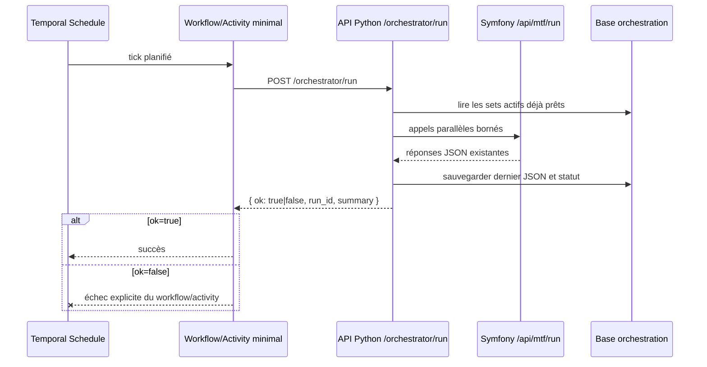
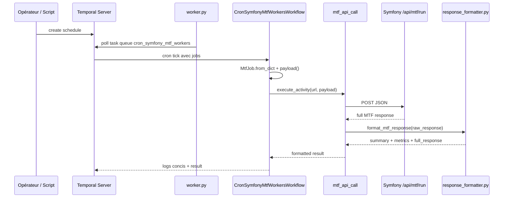

# Temporal Workers

Le sous-projet `cron_symfony_mtf_workers/` orchestre historiquement des appels planifiés vers Symfony. Il ne valide pas les signaux lui-même : il construit des jobs, démarre un workflow Temporal, appelle l'API Symfony, compacte la réponse et conserve la réponse complète dans le résultat workflow.

La cible fonctionnelle retenue pour la suite est plus simple : Temporal redevient un déclencheur planifié basique. L'orchestration parallèle, les sets de payloads, la conservation du dernier JSON et la visualisation sont portés par une API Python dédiée.

## Décision cible

| Composant | Responsabilité cible |
| --- | --- |
| Temporal schedule | Déclencher périodiquement un run. |
| Temporal workflow / activity | Appeler une URL unique de l'orchestrateur Python, retourner OK / non OK et échouer explicitement si `ok=false`. |
| API Python orchestratrice | Lire les sets prêts, lancer les appels Symfony en parallèle, agréger, persister le dernier JSON. |
| Symfony / TradingV3 | Rester le moteur métier : `/api/mtf/run`, `/api/mtf/sync-contracts`, configuration `mtf_contracts`. |
| Front cockpit | Paramétrer les sets, lancer un run manuel, visualiser le dernier retour JSON. |

Cette décision évite de faire porter à Temporal la logique de sélection, de découpage, de concurrence et d'audit des appels. Temporal reste utile comme cron supervisé, mais ne devient pas le moteur d'orchestration trading.

## Flux cible simplifié



## Responsabilités legacy

> **DEPRECATED (CLEAN-001).** Le chemin legacy multi-jobs ci-dessous
> (`CronSymfonyMtfWorkersWorkflow` + `mtf_api_call` + `MtfJob` +
> `response_formatter` et les 3 scripts `manage_mtf_workers` /
> `manage_scalper_micro` / `manage_exchange_profile`) est **déprécié**. La cible
> est le **schedule orchestrateur unique** (`scripts/manage_orchestrator_schedule.py`
> → `OrchestratorCronWorkflow` → un seul `POST /orchestrator/run`, cf. §Schedule
> cible). Il reste 100 % fonctionnel pendant la transition : lancer un script
> legacy émet désormais un `DeprecationWarning`, et le workflow legacy journalise
> un avertissement (`workflow.logger.warning`). Aucune suppression n'est faite
> dans CLEAN-001 (jalon ultérieur) ; les scripts **actifs** `manage_contract_sync`
> et `manage_cleanup` ne sont pas concernés.

| Composant | Fichier | Rôle |
| --- | --- | --- |
| Worker process | `cron_symfony_mtf_workers/worker.py` | Se connecte à Temporal, enregistre workflow et activity sur la task queue. |
| Workflow legacy | `workflows/mtf_workers.py` | Normalise les jobs, exécute `mtf_api_call`, logge le résumé. |
| Activity HTTP legacy | `activities/mtf_http.py` | POST JSON vers Symfony, parse la réponse, appelle le formatter. |
| Model job | `models/mtf_job.py` | Normalise URL, workers, dry-run, profile, exchange, market type, timeout et symboles. |
| Formatter | `utils/response_formatter.py` | Réduit une réponse MTF longue en résumé exploitable. |
| Schedules | `scripts/manage_*.py` | Crée, lit, pause, reprend ou supprime les schedules. |
| Tests | `tests/*.py` | Valide le formatter et les helpers de schedules. |

## Flux legacy actuel



## Payload `MtfJob`

Le modèle `MtfJob` accepte :

| Champ | Défaut | Description |
| --- | --- | --- |
| `url` | requis | Endpoint appelé, souvent `http://trading-app-nginx:80/api/mtf/run`. |
| `workers` | `4` | Nombre de workers côté runner Symfony. |
| `dry_run` | `true` | Simule ou exécute réellement. |
| `force_run` | `false` | Ignore certains garde-fous de cadence. |
| `force_timeframe_check` | `false` | Force les contrôles timeframe. |
| `current_tf` | `null` | Timeframe courant imposé si fourni. |
| `symbols` | `[]` | Liste optionnelle de symboles. |
| `exchange` | `null` | Exchange explicite : `bitmart`, `okx`, `hyperliquid`, `fake`, etc. |
| `market_type` | `null` | Type de marché, par exemple `perpetual` ou `spot`. |
| `mtf_profile` | `null` | Profil MTF : `regular`, `scalper`, `scalper_micro`. |
| `timeout_minutes` | `15` | Timeout workflow/activity par job. |

Le payload envoyé à Symfony garde uniquement les champs utiles :

```json
{
  "workers": 4,
  "dry_run": true,
  "force_run": false,
  "force_timeframe_check": false,
  "mtf_profile": "scalper_micro",
  "exchange": "bitmart",
  "market_type": "perpetual"
}
```

`url` sert à choisir l'endpoint HTTP. `timeout_minutes` sert au timeout Temporal. Ces deux champs ne font pas partie du JSON métier envoyé à Symfony.

## Rôle cible de l'activity Temporal

Dans la cible, l'activity Temporal ne construit plus plusieurs jobs Symfony. Elle appelle une seule URL :

```text
POST /orchestrator/run
```

Retour minimal attendu :

```json
{
  "ok": true,
  "run_id": "run_20260616_001",
  "status": "success",
  "summary": {
    "total_calls": 6,
    "success": 6,
    "failed": 0
  }
}
```

Contrat important : `ok=false` n'est pas un succès Temporal.

Le workflow minimal échoue explicitement lorsque l'orchestrateur retourne `ok=false` (implémenté par **TM-002**) : après avoir journalisé le `run_id` et le résumé, `OrchestratorCronWorkflow` lève une `temporalio.exceptions.ApplicationError` (type `OrchestratorRunFailed`, message incluant `status`, `run_id` et `summary`). Il ne faut pas seulement retourner un JSON contenant `ok=false`, sinon Temporal afficherait le tick comme réussi. L'`ApplicationError` est `non_retryable=True` : un tick `ok=false` ne doit pas être re-tenté en boucle dans le même tick — le prochain tick cron est le « retry » naturel (overlap `BUFFER_ONE`). L'activity `orchestrator_run`, elle, reste inchangée : elle retourne le `RunResponse`/dict `ok=false` verbatim (source de vérité pour la persistance côté API Python) ; la levée vit uniquement dans le workflow.

Le JSON complet et les détails par set restent dans l'API Python et dans la base d'orchestration.

## Scripts de schedules legacy

| Script | Statut | Usage |
| --- | --- | --- |
| `scripts/manage_exchange_profile_schedule.py` | **DEPRECATED (CLEAN-001)** | Schedule explicite par `exchange`, `market_type`, `profile`, cadence et dry-run. → Migrer vers `manage_orchestrator_schedule.py`. |
| `scripts/manage_mtf_workers_schedule.py` | **DEPRECATED (CLEAN-001)** | Ancien schedule générique vers `/api/mtf/run`. → Migrer vers `manage_orchestrator_schedule.py`. |
| `scripts/manage_scalper_micro_schedule.py` | **DEPRECATED (CLEAN-001)** | Ancien schedule dédié `scalper_micro`. → Migrer vers `manage_orchestrator_schedule.py`. |
| `scripts/manage_contract_sync_schedule.py` | actif | Sync quotidienne des contrats via `/api/mtf/sync-contracts`. |
| `scripts/manage_cleanup_schedule.py` | actif | Jobs de cleanup. |

Le chemin cible est le **schedule unique vers l'orchestrateur Python**
(`scripts/manage_orchestrator_schedule.py`, cf. §Schedule cible). Les 3 scripts
legacy ci-dessus sont **dépréciés (CLEAN-001)** : ils restent disponibles et
fonctionnels tant que la transition n'est pas terminée, mais émettent un
`DeprecationWarning` au lancement et ne doivent plus servir à créer de nouveaux
schedules. La suppression effective est un jalon ultérieur ; le guide de
migration détaillé (CLEAN-002) est
[Migration legacy → orchestrateur](legacy-migration.md).

## Schedule cible (orchestrateur)

TM-001 livre le déclencheur cron minimal vers l'orchestrateur Python. Un schedule unique démarre `OrchestratorCronWorkflow`, qui exécute l'unique activity `orchestrator_run` : un seul `POST /orchestrator/run`. Aucune sélection de contrats côté Temporal — la sélection des sets, la concurrence, l'agrégation et la conservation du JSON sont portées par l'API Python (PY-005/PY-006).

| Script | Statut | Usage |
| --- | --- | --- |
| `scripts/manage_orchestrator_schedule.py` | cible | Schedule cron unique vers `POST /orchestrator/run` (`OrchestratorCronWorkflow`). |

Composants (à côté du legacy, task queue inchangée `cron_symfony_mtf_workers`) :

- `activities/orchestrator_http.py` (`orchestrator_run`) : POST httpx du `RunRequest` minimal (`dashboard_id`, `schedule_id`, `tick_timestamp`) et retour du `RunResponse` tel quel. En cas d'erreur réseau / corps non JSON, un dict explicite `ok=false` est renvoyé (jamais d'exception). Inchangée par TM-002 (« return verbatim »).
- `workflows/orchestrator_cron.py` (`OrchestratorCronWorkflow`) : exécute l'unique activity, journalise `run_id` + `summary`, puis sur `ok=true` propage le résultat et sur `ok=false` lève une `ApplicationError` non-retryable (TM-002) pour marquer le tick en échec. Le `tick_timestamp` est dérivé de `workflow.now()` (déterminisme : aucune I/O ni `datetime.now()` dans le workflow ; le log précède toujours la levée).

Sous-commandes (mêmes conventions que `manage_exchange_profile_schedule.py`) : `create` / `pause` / `resume` / `delete` / `status`. Overlap `BUFFER_ONE`.

Paramètres via env (surchargés par les options CLI `--url`, `--dashboard-id`, `--cron`, `--schedule-id`, `--workflow-id`) :

| Variable | Défaut |
| --- | --- |
| `ORCHESTRATOR_RUN_URL` | `http://python-orchestrator:8099/orchestrator/run` |
| `ORCHESTRATOR_DASHBOARD_ID` | _(aucun)_ |
| `ORCHESTRATOR_SCHEDULE_ID` | `cron-orchestrator-run-1m` |
| `ORCHESTRATOR_WORKFLOW_ID` | `cron-orchestrator-run-runner` |
| `ORCHESTRATOR_CRON` | `*/1 * * * *` |

```bash
# Prévisualiser le schedule cible sans rien créer
python scripts/manage_orchestrator_schedule.py create --dry-run --dashboard-id 7

# Créer / piloter le schedule
python scripts/manage_orchestrator_schedule.py create --dashboard-id 7
python scripts/manage_orchestrator_schedule.py status
python scripts/manage_orchestrator_schedule.py pause
python scripts/manage_orchestrator_schedule.py resume
python scripts/manage_orchestrator_schedule.py delete
```

> `ok=false` n'est pas un succès Temporal : l'activity remonte le `RunResponse` complet et le workflow lève une `ApplicationError` non-retryable sur `ok=false` (implémenté par **TM-002**), après avoir journalisé `run_id` + `summary`.

## Garde-fous live

Avant tout `dry_run=false`, conserver les règles :

- pas de live OKX ;
- pas de live Hyperliquid ;
- Bitmart live uniquement tant que le runtime legacy le justifie ;
- aucune position sans stop-loss automatique immédiatement attaché ;
- pas de double soumission pour un même symbole ;
- idempotence et lock par symbole obligatoires avant tout live orchestré.

## Observabilité cible

Temporal garde un résultat court : `ok`, `run_id`, statut et résumé. L'API Python garde :

- le dernier JSON global retourné ;
- le dernier JSON par set ;
- le payload envoyé à Symfony ;
- la réponse brute Symfony ;
- l'erreur si l'appel a échoué ;
- le statut agrégé ;
- l'historique minimal des runs.

## Tests

Depuis `cron_symfony_mtf_workers/` :

```bash
pytest
pytest tests/test_response_formatter.py
pytest tests/test_manage_exchange_profile_schedule.py
pytest tests/test_orchestrator_workflow.py
pytest tests/test_manage_orchestrator_schedule.py
```

**Couverture + gate CI (QA-003)** — le cron a son filet de couverture propre,
**sans serveur Temporal ni réseau** (primitives `workflow.*` patchées, fakes
`httpx`) :

```bash
pip install -r requirements-dev.txt
pytest --cov --cov-report=term-missing   # gate --cov-fail-under=99
```

Périmètre mesuré (figé dans `pyproject.toml`) : les seuls fichiers du cron
orchestrateur (`activities/orchestrator_http.py`, `workflows/orchestrator_cron.py`,
`scripts/manage_orchestrator_schedule.py`). Baseline 99.12 %, gate
`--cov-fail-under=99` câblé dans `.github/workflows/temporal-cron.yml` (workflow
CI dédié, aucun service externe). Détails : `cron_symfony_mtf_workers/README.md`
§6 et la ligne QA-003 du plan de PR dans `python-orchestrator.md`.

Après création de l'orchestrateur Python, les tests attendus devront aussi couvrir :

- appel unique Temporal vers `/orchestrator/run` ;
- retour `ok=true` / `ok=false` ;
- échec explicite du workflow/activity lorsque `ok=false` ;
- stockage du dernier JSON côté API Python ;
- absence de logique de sélection des contrats dans Temporal.
