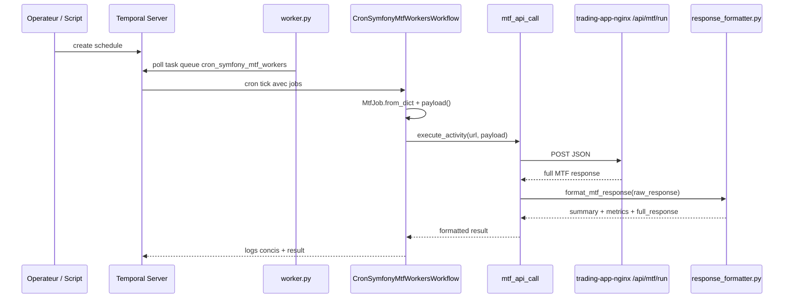

# Temporal Workers

Le sous-projet `cron_symfony_mtf_workers/` orchestre les appels planifies vers Symfony. Il ne valide pas les signaux lui-meme: il construit des jobs, demarre un workflow Temporal, appelle l'API Symfony, compacte la reponse et conserve la reponse complete dans le resultat workflow.

## Responsabilites

| Composant | Fichier | Role |
| --- | --- | --- |
| Worker process | `cron_symfony_mtf_workers/worker.py` | Se connecte a Temporal, enregistre workflow et activity sur la task queue. |
| Workflow legacy | `workflows/mtf_workers.py` | `CronSymfonyMtfWorkersWorkflow` : chemin direct historique, execute `mtf_api_call` par job. Inchange. |
| Workflow dashboard | `workflows/mtf_dashboard.py` | `MtfDashboardOrchestratorWorkflow` : orchestre une matrice dashboard, une Activity par target, bounded concurrency, all-or-nothing. Voir `technical/temporal-dashboard-orchestrator.md`. |
| Activity HTTP | `activities/mtf_http.py` | POST JSON vers Symfony, parse la reponse, appelle le formatteur. |
| Activities dashboard | `activities/dashboard.py` | `load_dashboard_snapshot`, `runtime_check_target`, `call_mtf_run_target` (une Activity par concern/target). |
| Model job | `models/mtf_job.py` | Normalise URL, workers, dry-run, profile, exchange, market type, timeout et symboles. |
| Formatter | `utils/response_formatter.py` | Reduit une reponse MTF longue en resume exploitable dans Temporal UI. |
| Schedules | `scripts/manage_*.py` | Cree, lit, pause, reprend ou supprime les schedules. |
| Tests | `tests/*.py` | Valide le formatteur et les helpers de schedules. |

## Flux d'execution



## Payload `MtfJob`

Le model `MtfJob` accepte:

| Champ | Defaut | Description |
| --- | --- | --- |
| `url` | requis | Endpoint appele, souvent `http://trading-app-nginx:80/api/mtf/run`. |
| `workers` | `4` | Nombre de workers cote runner Symfony. |
| `dry_run` | `true` | Simule ou execute reellement. |
| `force_run` | `false` | Ignore certains garde-fous de cadence. |
| `force_timeframe_check` | `false` | Force les controles timeframe. |
| `current_tf` | `null` | Timeframe courant impose si fourni. |
| `symbols` | `[]` | Liste optionnelle de symboles. |
| `exchange` | `null` | Exchange explicite: `bitmart`, `okx`, `hyperliquid`, `fake`, etc. |
| `market_type` | `null` | Type de marche, par exemple `perpetual` ou `spot`. |
| `mtf_profile` | `null` | Profil MTF: `regular`, `scalper`, `scalper_micro`. |
| `timeout_minutes` | `15` | Timeout workflow/activity par job. |

Le payload envoye a Symfony garde uniquement les champs utiles:

```json
{
  "workers": 4,
  "dry_run": true,
  "force_run": false,
  "force_timeframe_check": false,
  "mtf_profile": "scalper_micro",
  "exchange": "bitmart",
  "market_type": "perpetual"
}
```

## Scripts de schedules

| Script | Statut | Usage |
| --- | --- | --- |
| `scripts/manage_exchange_profile_schedule.py` | recommande | Schedule explicite par `exchange`, `market_type`, `profile`, cadence et dry-run. |
| `scripts/manage_dashboard_schedule.py` | recommande | Schedule pilote par dashboard (matrice de targets) via `MtfDashboardOrchestratorWorkflow`. Voir `technical/temporal-dashboard-orchestrator.md`. |
| `scripts/manage_mtf_workers_schedule.py` | legacy | Ancien schedule generique vers `/api/mtf/run`. |
| `scripts/manage_scalper_micro_schedule.py` | legacy | Ancien schedule dedie `scalper_micro`. |
| `scripts/manage_contract_sync_schedule.py` | actif | Sync quotidienne des contrats via `/api/mtf/sync-contracts`. |
| `scripts/manage_cleanup_schedule.py` | actif | Jobs de cleanup. |

Actions communes:

```bash
python scripts/manage_exchange_profile_schedule.py create --exchange=bitmart --profile=scalper_micro --dry-run=true
python scripts/manage_exchange_profile_schedule.py status --schedule-id=cron-mtf-bitmart-scalper-micro-1m
python scripts/manage_exchange_profile_schedule.py pause --schedule-id=cron-mtf-bitmart-scalper-micro-1m
python scripts/manage_exchange_profile_schedule.py resume --schedule-id=cron-mtf-bitmart-scalper-micro-1m
python scripts/manage_exchange_profile_schedule.py delete --schedule-id=cron-mtf-bitmart-scalper-micro-1m
```

## IDs generes

`manage_exchange_profile_schedule.py` genere les IDs avec:

- `generate_schedule_id(exchange, profile, cron, market_type)`;
- `generate_workflow_id(exchange, profile, market_type)`.

Exemples:

| Entree | Schedule ID | Workflow ID |
| --- | --- | --- |
| Bitmart + scalper micro + `*/1 * * * *` | `cron-mtf-bitmart-scalper-micro-1m` | `mtf-bitmart-scalper-micro-runner` |
| OKX + scalper + `*/1 * * * *` | `cron-mtf-okx-scalper-1m` | `mtf-okx-scalper-runner` |
| Hyperliquid + regular + `*/5 * * * *` | `cron-mtf-hyperliquid-regular-5m` | `mtf-hyperliquid-regular-runner` |
| OKX spot + scalper + `*/1 * * * *` | `cron-mtf-okx-spot-scalper-1m` | `mtf-okx-spot-scalper-runner` |

Le `market_type=perpetual` est omis dans l'ID pour garder les noms historiques. Les autres types sont inclus pour eviter les collisions.

## Garde-fous live

Avant un schedule `dry_run=false`, le script recommande ou impose le diagnostic:

```bash
docker compose exec -T trading-app-php php bin/console app:exchange:runtime-check bitmart perpetual
```

Pour `dry_run=false`, les champs attendus sont:

| Check | Valeur attendue |
| --- | --- |
| `schedule_ready` | `yes` |
| `credentials` | `ok` |
| `live_trading` | `enabled` |

Si `dry_run=true`, un `schedule_ready: no` est tolere avec warning.

## Lancement Docker

Lancer Temporal, son UI et le worker:

```bash
docker compose up -d postgresql temporal temporal-ui cron-symfony-mtf-workers
```

L'application cible doit aussi etre disponible:

```bash
docker compose up -d trading-app-db redis trading-app-php trading-app-nginx
```

UI:

```text
http://localhost:8233
```

Logs:

```bash
docker compose logs -f cron-symfony-mtf-workers
```

## Lancement local

```bash
cd cron_symfony_mtf_workers
python -m venv .venv
source .venv/bin/activate
pip install -r requirements.txt
export TEMPORAL_ADDRESS=localhost:7233
export TEMPORAL_NAMESPACE=default
export TASK_QUEUE_NAME=cron_symfony_mtf_workers
python worker.py
```

En Docker compose, `TEMPORAL_ADDRESS` vaut plutot `temporal:7233`.

## Observabilite

Le workflow logge volontairement un resume court:

- duree du run;
- nombre de symboles traites;
- success rate;
- symboles `SUCCESS` par timeframe;
- `INVALID` par timeframe.

La reponse complete reste disponible dans `full_response` pour investigation Temporal UI.

## Tests

Depuis `cron_symfony_mtf_workers/`:

```bash
pytest
pytest tests/test_response_formatter.py
pytest tests/test_manage_exchange_profile_schedule.py
```

Ces tests doivent etre relances apres modification de formatter, generation d'IDs, garde-fous live ou structure de payload.
