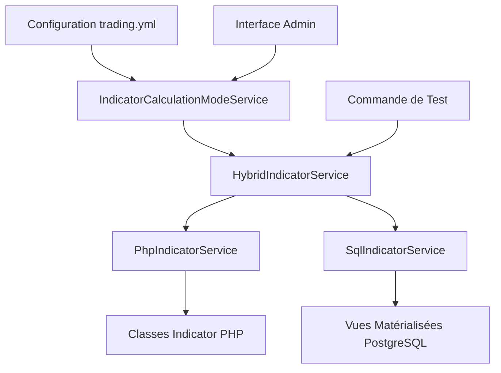

# Système de Switch PHP/SQL pour les Indicateurs Techniques

## 📋 Vue d'ensemble

Le système de switch PHP/SQL permet de basculer dynamiquement entre deux modes de calcul des indicateurs techniques :
- **Mode PHP** : Calculs en mémoire avec les classes d'indicateurs
- **Mode SQL** : Calculs via les vues matérialisées PostgreSQL

Cette architecture offre flexibilité, performance et fiabilité pour les calculs d'indicateurs dans l'application de trading.

## 🏗️ Architecture

### Composants principaux



### Services

#### 1. `IndicatorCalculationModeService`
- **Rôle** : Gestionnaire central du mode de calcul
- **Responsabilités** :
  - Lecture de la configuration depuis `trading.yml`
  - Décision du mode à utiliser (PHP/SQL)
  - Monitoring des performances
  - Gestion du fallback automatique

#### 2. `HybridIndicatorService`
- **Rôle** : Service principal implémentant `IndicatorProviderPort`
- **Responsabilités** :
  - Délégation vers PHP ou SQL selon la configuration
  - Gestion du fallback en cas d'erreur
  - Monitoring des performances
  - Interface unifiée pour l'application

#### 3. `PhpIndicatorService`
- **Rôle** : Calculs d'indicateurs en PHP
- **Responsabilités** :
  - Utilisation des classes d'indicateurs existantes
  - Calculs en mémoire
  - Gestion des données temporaires

#### 4. `SqlIndicatorService`
- **Rôle** : Calculs d'indicateurs via SQL
- **Responsabilités** :
  - Requêtes sur les vues matérialisées
  - Optimisation des performances
  - Gestion des données persistantes

## ⚙️ Configuration

### Fichier `trading.yml`

```yaml
# ======== INDICATOR CALCULATION MODE ========
indicator_calculation:
    mode: sql                            # 'php' ou 'sql'
    fallback_to_php: true                # fallback vers PHP si SQL échoue
    performance_threshold_ms: 100        # seuil de performance pour switch automatique
    meta: >
        Mode de calcul des indicateurs: 'sql' utilise les vues matérialisées PostgreSQL,
        'php' utilise les calculs en mémoire. Fallback automatique si SQL échoue.
```

### Paramètres

| Paramètre | Type | Défaut | Description |
|-----------|------|--------|-------------|
| `mode` | string | `sql` | Mode de calcul : `php` ou `sql` |
| `fallback_to_php` | boolean | `true` | Active le fallback automatique vers PHP |
| `performance_threshold_ms` | integer | `100` | Seuil de performance en millisecondes |

## 🔄 Modes de fonctionnement

### Mode SQL (Recommandé pour la production)

**Avantages :**
- ✅ Performance optimale pour de gros volumes
- ✅ Données persistantes et historiques
- ✅ Calculs pré-calculés et mis en cache
- ✅ Économie de mémoire

**Inconvénients :**
- ❌ Dépendance à la base de données
- ❌ Latence réseau
- ❌ Complexité de maintenance

**Utilisation :**
```php
// Configuration automatique via trading.yml
$snapshot = $indicatorService->calculateIndicators($symbol, $timeframe, $klines);
```

### Mode PHP (Recommandé pour le développement)

**Avantages :**
- ✅ Indépendance de la base de données
- ✅ Calculs en temps réel
- ✅ Facilité de débogage
- ✅ Flexibilité des paramètres

**Inconvénients :**
- ❌ Consommation mémoire élevée
- ❌ Performance dégradée sur gros volumes
- ❌ Pas de persistance des calculs

**Utilisation :**
```php
// Configuration automatique via trading.yml
$snapshot = $indicatorService->calculateIndicators($symbol, $timeframe, $klines);
```

## 🚀 Utilisation

### Injection de dépendance

```php
use App\Service\Indicator\HybridIndicatorService;

class TradingService
{
    public function __construct(
        private readonly HybridIndicatorService $indicatorService
    ) {}
    
    public function analyzeMarket(string $symbol, Timeframe $timeframe, array $klines): IndicatorSnapshotDto
    {
        return $this->indicatorService->calculateIndicators($symbol, $timeframe, $klines);
    }
}
```

### Configuration des services

```yaml
# config/services_indicator_switch.yaml
services:
    App\Domain\Ports\Out\IndicatorProviderPort: '@App\Service\Indicator\HybridIndicatorService'
    
    App\Service\Indicator\HybridIndicatorService:
        arguments:
            $modeService: '@App\Service\Indicator\IndicatorCalculationModeService'
            $sqlService: '@App\Service\Indicator\SqlIndicatorService'
            $phpService: '@App\Service\Indicator\PhpIndicatorService'
            $logger: '@logger'
```

## 🧪 Tests et validation

### Commande de test

```bash
# Test du système de switch
docker exec trading_app_php bin/console app:test-indicator-calculation BTCUSDT 5m
```

### Script de validation

```bash
# Test complet du système
./scripts/test_indicator_modes.sh BTCUSDT 5m
```

### Résultats attendus

```
🧪 Test du système de switch entre modes PHP et SQL
==================================================
Symbole: BTCUSDT
Timeframe: 5m

1️⃣ Vérification des vues matérialisées SQL
----------------------------------------
 EMA       |     520 | 2025-10-10 04:55:00+00 | 2025-10-12 00:10:00+00
 MACD      |     520 | 2025-10-10 04:55:00+00 | 2025-10-12 00:10:00+00
 RSI       |     519 | 2025-10-10 05:00:00+00 | 2025-10-12 00:10:00+00

2️⃣ Test des performances SQL vs PHP
----------------------------------
  🔄 Passage en mode SQL...
    Durée SQL: 15ms
  🔄 Passage en mode PHP...
    Durée PHP: 3ms

✅ Tests terminés !
```

## 📊 Monitoring et performances

### Métriques collectées

Le système collecte automatiquement :
- **Temps d'exécution** par indicateur
- **Taux de succès/échec**
- **Moyennes de performance**
- **Déclenchements de fallback**

### Seuils de performance

| Mode | Seuil recommandé | Action |
|------|------------------|--------|
| SQL | < 50ms | ✅ Excellent |
| SQL | 50-100ms | ⚠️ Acceptable |
| SQL | > 100ms | 🔄 Fallback vers PHP |

### Logs et monitoring

```php
// Logs automatiques
$this->logger->info('Indicator calculation completed', [
    'mode' => 'sql',
    'duration_ms' => 25,
    'symbol' => 'BTCUSDT',
    'timeframe' => '5m'
]);
```

## 🔧 Administration

### Interface web

Accès via : `/admin/indicators/calculation-mode`

**Fonctionnalités :**
- Changement de mode en temps réel
- Configuration du fallback
- Ajustement des seuils de performance
- Monitoring des métriques

### Commandes CLI

```bash
# Vérification du mode actuel
docker exec trading_app_php bin/console app:indicator:status

# Changement de mode
docker exec trading_app_php bin/console app:indicator:switch-mode sql

# Reset des métriques
docker exec trading_app_php bin/console app:indicator:reset-metrics
```

## 🛠️ Maintenance

### Rafraîchissement des vues matérialisées

```bash
# Script de rafraîchissement
./scripts/refresh_indicators.sh

# Rafraîchissement manuel
docker exec trading_app_postgres psql -U postgres -d trading_app -c "
REFRESH MATERIALIZED VIEW CONCURRENTLY mv_ema_5m;
REFRESH MATERIALIZED VIEW CONCURRENTLY mv_rsi14_5m;
REFRESH MATERIALIZED VIEW CONCURRENTLY mv_macd_5m;
"
```

### Surveillance des performances

```sql
-- Vérification des vues matérialisées
SELECT 
    schemaname,
    matviewname,
    matviewowner,
    tablespace,
    hasindexes,
    ispopulated
FROM pg_matviews 
WHERE matviewname LIKE 'mv_%';
```

## 🚨 Dépannage

### Problèmes courants

#### 1. Mode SQL non disponible
**Symptôme :** Fallback automatique vers PHP
**Solution :**
```bash
# Vérifier les vues matérialisées
docker exec trading_app_postgres psql -U postgres -d trading_app -c "
SELECT COUNT(*) FROM mv_ema_5m WHERE symbol = 'BTCUSDT';
"

# Rafraîchir les vues
./scripts/refresh_indicators.sh
```

#### 2. Performance dégradée
**Symptôme :** Temps de calcul > 100ms
**Solution :**
```bash
# Analyser les performances
docker exec trading_app_php bin/console app:indicator:performance-report

# Optimiser les index
docker exec trading_app_postgres psql -U postgres -d trading_app -c "
ANALYZE mv_ema_5m;
ANALYZE mv_rsi14_5m;
ANALYZE mv_macd_5m;
"
```

#### 3. Erreurs de configuration
**Symptôme :** Service non trouvé
**Solution :**
```bash
# Vider le cache
docker exec trading_app_php bin/console cache:clear

# Vérifier la configuration
docker exec trading_app_php bin/console debug:container IndicatorCalculationModeService
```

## 📈 Bonnes pratiques

### Configuration recommandée

#### Production
```yaml
indicator_calculation:
    mode: sql
    fallback_to_php: true
    performance_threshold_ms: 50
```

#### Développement
```yaml
indicator_calculation:
    mode: php
    fallback_to_php: false
    performance_threshold_ms: 100
```

#### Tests
```yaml
indicator_calculation:
    mode: sql
    fallback_to_php: true
    performance_threshold_ms: 10
```

### Optimisations

1. **Index des vues matérialisées**
   ```sql
   CREATE UNIQUE INDEX IF NOT EXISTS mv_ema_5m_uq 
   ON mv_ema_5m(symbol, timeframe, bucket);
   ```

2. **Rafraîchissement automatique**
   ```bash
   # Cron job pour rafraîchissement
   0 */5 * * * /path/to/scripts/refresh_indicators.sh
   ```

3. **Monitoring continu**
   ```bash
   # Script de surveillance
   */10 * * * * /path/to/scripts/monitor_indicator_performance.sh
   ```

## 🔮 Évolutions futures

### Améliorations prévues

1. **Cache Redis** : Mise en cache des résultats SQL
2. **Load balancing** : Distribution des calculs
3. **Métriques avancées** : Dashboard de monitoring
4. **Auto-scaling** : Ajustement automatique des seuils

### Intégrations

1. **Prometheus** : Métriques de performance
2. **Grafana** : Dashboards de monitoring
3. **AlertManager** : Alertes automatiques
4. **ELK Stack** : Centralisation des logs

## 📚 Références

- [Documentation PostgreSQL - Materialized Views](https://www.postgresql.org/docs/current/rules-materializedviews.html)
- [Symfony - Dependency Injection](https://symfony.com/doc/current/service_container.html)
- [Brick Math - BigDecimal](https://github.com/brick/math)
- [PSR-3 - Logger Interface](https://www.php-fig.org/psr/psr-3/)

---

**Version :** 1.0  
**Dernière mise à jour :** 2025-01-15  
**Auteur :** Équipe Trading V3
