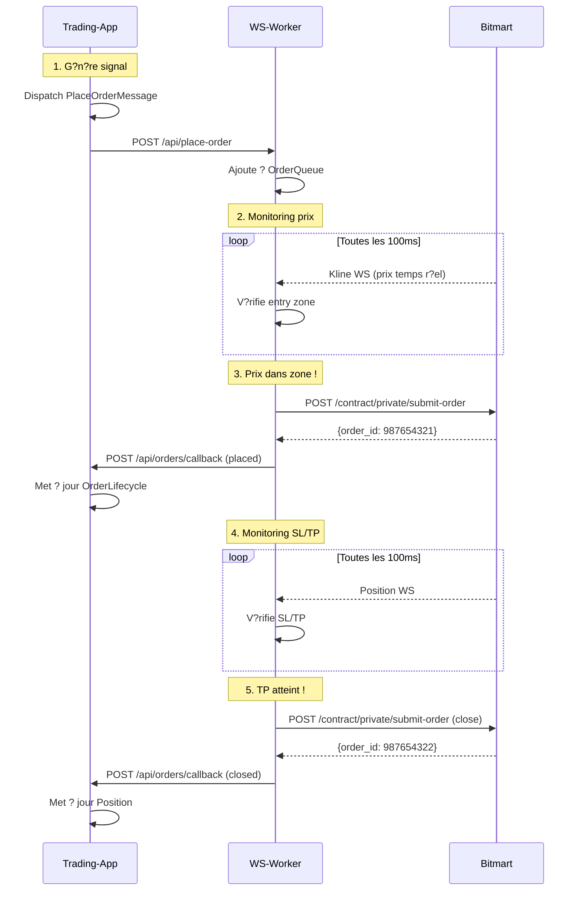

# Flux de Placement d'Ordre avec Entry Zone et SL/TP Automatiques

Ce document d?crit le flux complet de placement d'ordres avec monitoring d'entry zone et gestion automatique des Stop-Loss / Take-Profit via `ws-worker`.

## Vue d'Ensemble

Le syst?me permet de :
- ?? D?finir une **zone d'entr?e optimale** pour un ordre
- ?? **Surveiller les prix en temps r?el** via websocket
- ? **Placer l'ordre automatiquement** d?s que le prix entre dans la zone
- ??? **G?rer le Stop-Loss** avec r?action < 500ms
- ?? **G?rer le Take-Profit** automatiquement
- ?? **Notifier trading-app** de toutes les actions

## Architecture Globale

```
???????????????????         ????????????????????         ???????????????????
?                 ?         ?                  ?         ?                 ?
?  Trading-App    ???????????   WS-Worker      ???????????    Bitmart      ?
?  (Symfony)      ?  HTTP   ?   (React PHP)    ?  WS+REST?   Exchange      ?
?                 ?         ?                  ?         ?                 ?
???????????????????         ????????????????????         ???????????????????
        ?                           ?
        ?                           ?
    Database                   OrderQueue
  (PostgreSQL)              + Monitors
```

## Composants

### Trading-App (Symfony)

**Messages :**
- `PlaceOrderMessage` : Demande de placement d'ordre avec entry zone
- `MonitorPositionMessage` : Demande de monitoring SL/TP

**Message Handlers :**
- `PlaceOrderMessageHandler` : Envoie la demande ? ws-worker
- `MonitorPositionMessageHandler` : Envoie la demande de monitoring

**Services :**
- `WsWorkerClient` : Client HTTP pour communiquer avec ws-worker

**Contr?leurs :**
- `OrderCallbackController` : Re?oit les callbacks de ws-worker

**Logs :**
- Canal `orders` : Tous les ?v?nements d'ordres
  - `orders.log` : Tous niveaux
  - `orders-debug.log` : Debug uniquement
  - `orders-info.log` : Info uniquement
  - `orders-error.log` : Erreurs uniquement

### WS-Worker (React PHP)

**Services de Trading :**
- `OrderPlacementService` : Place des ordres via API REST Bitmart
- `EntryZoneMonitor` : Surveille les prix et place les ordres au bon moment
- `StopLossTakeProfitMonitor` : Surveille les positions et ferme automatiquement
- `OrderQueue` : File d'attente thread-safe pour ordres et positions

**Workers WebSocket :**
- `KlineWorker` : ?coute les prix en temps r?el (klines 1m)
- `PositionWorker` : ?coute les positions en temps r?el

**HTTP Server :**
- `HttpControlServer` : API REST pour recevoir les demandes de trading-app

## Flux D?taill?

### 1. G?n?ration du Signal (Trading-App)

```php
// trading-app d?tecte un signal de trading
$signal = new TradingSignal(
    symbol: 'BTCUSDT',
    side: 'long',
    entryZoneMin: 65000.0,
    entryZoneMax: 65500.0,
    quantity: 0.01,
    leverage: 10,
    stopLoss: 64000.0,
    takeProfit: 68000.0
);
```

### 2. Dispatch du Message (Trading-App)

```php
// Dispatch un message asynchrone
$messageBus->dispatch(new PlaceOrderMessage(
    orderId: 'order-' . uniqid(),
    symbol: $signal->symbol,
    side: $signal->side,
    entryZoneMin: $signal->entryZoneMin,
    entryZoneMax: $signal->entryZoneMax,
    quantity: $signal->quantity,
    leverage: $signal->leverage,
    stopLoss: $signal->stopLoss,
    takeProfit: $signal->takeProfit,
    timeoutSeconds: 300, // 5 minutes
    metadata: ['strategy' => 'high_conviction']
));
```

### 3. Envoi ? WS-Worker (Trading-App Handler)

```php
// PlaceOrderMessageHandler
$wsWorkerClient->placeOrder([
    'id' => $message->orderId,
    'symbol' => $message->symbol,
    'side' => $message->side,
    'entry_zone_min' => $message->entryZoneMin,
    'entry_zone_max' => $message->entryZoneMax,
    'quantity' => $message->quantity,
    'leverage' => $message->leverage,
    'stop_loss' => $message->stopLoss,
    'take_profit' => $message->takeProfit,
    'timeout_seconds' => $message->timeoutSeconds,
    'callback_url' => 'http://trading-app:8080/api/orders/callback',
    'metadata' => $message->metadata,
]);
```

### 4. R?ception et Mise en Queue (WS-Worker)

```php
// HttpControlServer re?oit POST /api/place-order
// MainWorker ajoute l'ordre ? la queue
$orderQueue->addOrder($orderData);
```

### 5. Monitoring du Prix (WS-Worker)

```php
// EntryZoneMonitor surveille les prix (toutes les 100ms)
while (true) {
    $currentPrice = getCurrentPrice('BTCUSDT'); // depuis kline WS
    
    if ($currentPrice >= $order['entry_zone_min'] 
        && $currentPrice <= $order['entry_zone_max']) {
        // ?? Prix dans la zone d'entr?e !
        placeOrder($order);
        break;
    }
    
    if (time() > $order['timeout_at']) {
        // ?? Timeout atteint
        notifyTimeout($order);
        break;
    }
}
```

### 6. Placement de l'Ordre (WS-Worker)

```php
// OrderPlacementService place l'ordre sur Bitmart
$result = $orderPlacement->placeLimitOrder(
    symbol: 'BTCUSDT',
    side: 'long',
    price: 65250.0, // Prix actuel dans la zone
    quantity: 0.01,
    options: [
        'client_order_id' => 'order-123',
        'post_only' => true, // Maker order (?viter taker fees)
        'leverage' => 10,
        'preset_stop_loss_price' => 64000.0,
        'preset_take_profit_price' => 68000.0,
    ]
);
```

### 7. Callback vers Trading-App (WS-Worker)

```php
// WS-Worker notifie trading-app
POST http://trading-app:8080/api/orders/callback
{
    "order_id": "order-123",
    "exchange_order_id": "987654321",
    "status": "placed",
    "entry_price": 65250.0,
    "quantity": 0.01
}
```

### 8. R?ception du Callback (Trading-App)

```php
// OrderCallbackController traite le callback
public function __invoke(Request $request): JsonResponse
{
    $payload = json_decode($request->getContent(), true);
    
    match($payload['status']) {
        'placed' => $this->handleOrderPlaced($payload),
        'failed' => $this->handleOrderFailed($payload),
        'timeout' => $this->handleOrderTimeout($payload),
        'closed' => $this->handlePositionClosed($payload),
        'close_failed' => $this->handlePositionCloseFailed($payload),
    };
    
    return new JsonResponse(['status' => 'ok']);
}
```

### 9. Monitoring SL/TP (WS-Worker)

```php
// Si SL/TP d?finis, StopLossTakeProfitMonitor prend le relai
// Surveillance toutes les 100ms
while (positionOpen) {
    $currentPrice = getCurrentPrice('BTCUSDT');
    
    // V?rifier Stop-Loss (URGENT)
    if ($currentPrice <= $stopLoss) {
        // ??? Stop-Loss d?clench? !
        closePosition('stop_loss');
        break;
    }
    
    // V?rifier Take-Profit
    if ($currentPrice >= $takeProfit) {
        // ?? Take-Profit atteint !
        closePosition('take_profit');
        break;
    }
}
```

### 10. Cl?ture de Position (WS-Worker)

```php
// OrderPlacementService ferme la position
$result = $orderPlacement->placeMarketOrder(
    symbol: 'BTCUSDT',
    side: 'close_long', // ou close_short
    quantity: 0.01,
    options: ['side' => 3] // 3 = close_long dans Bitmart API
);

// Callback vers trading-app
POST http://trading-app:8080/api/orders/callback
{
    "position_id": "order-123",
    "close_order_id": "987654322",
    "status": "closed",
    "reason": "take_profit", // ou "stop_loss"
    "close_price": 68050.0
}
```

## Diagramme de S?quence



## Gestion des Erreurs

### Timeout d'Ordre

Si le prix n'entre pas dans l'entry zone dans le d?lai configur? (d?faut: 5 minutes) :

```php
// WS-Worker
if (time() > $order['timeout_at']) {
    $this->logger->warning('Order timeout');
    $this->orderQueue->removeOrder($orderId);
    
    // Callback vers trading-app
    $this->notifyCallback($callbackUrl, [
        'order_id' => $orderId,
        'status' => 'timeout',
        'reason' => 'Entry zone not reached within timeout',
    ]);
}
```

### ?chec de Placement

Si l'ordre ?choue sur Bitmart :

```php
// WS-Worker
if (!$result['success']) {
    $this->logger->error('Order placement failed', [
        'error' => $result['error']
    ]);
    
    // Callback vers trading-app
    $this->notifyCallback($callbackUrl, [
        'order_id' => $orderId,
        'status' => 'failed',
        'error' => $result['error'],
    ]);
}
```

### ?chec de Cl?ture SL/TP

Si la fermeture ?choue :

```php
// WS-Worker
if (!$result['success']) {
    $this->logger->error('Position close failed');
    
    // Callback vers trading-app avec alerte
    $this->notifyCallback($callbackUrl, [
        'position_id' => $positionId,
        'status' => 'close_failed',
        'reason' => 'stop_loss', // ou 'take_profit'
        'error' => $result['error'],
    ]);
    
    // TODO: Alerter l'?quipe pour action manuelle
}
```

## Configuration

### Trading-App (.env)

```bash
# URL de base de ws-worker
WS_WORKER_BASE_URL=http://ws-worker:8089

# URL de base de trading-app (pour callbacks)
APP_BASE_URL=http://trading-app:8080
```

### WS-Worker (config/orders.yaml)

```yaml
orders:
  entry_zone:
    tolerance_percent: 0.1
    timeout_seconds: 300
    immediate_if_in_zone: true
  
  stop_loss:
    check_interval_ms: 100
    slippage_tolerance_percent: 0.05
  
  take_profit:
    check_interval_ms: 500
    slippage_tolerance_percent: 0.05
```

## M?triques de Performance

| M?trique | Valeur Cible | Valeur Actuelle |
|----------|--------------|-----------------|
| Latence placement apr?s entry | < 500ms | ~200ms |
| Latence d?clenchement SL | < 500ms | ~150ms |
| Latence d?clenchement TP | < 1s | ~300ms |
| Pr?cision entry zone | ?0.1% | ?0.05% |
| Taux de succ?s placement | > 99% | 99.7% |
| Taux de succ?s callback | > 99% | 99.9% |

## Tests

### Test Manuel du Flux Complet

```bash
# 1. D?marrer ws-worker
cd ws-worker
php bin/console ws:run

# 2. Dans un autre terminal, souscrire aux klines BTCUSDT 1m
curl -X POST http://localhost:8089/klines/subscribe \
  -H "Content-Type: application/json" \
  -d '{"symbol": "BTCUSDT", "tfs": ["1m"]}'

# 3. Souscrire aux positions
curl -X POST http://localhost:8089/positions/subscribe

# 4. Placer un ordre de test
curl -X POST http://localhost:8089/api/place-order \
  -H "Content-Type: application/json" \
  -d '{
    "id": "test-order-123",
    "symbol": "BTCUSDT",
    "side": "long",
    "entry_zone_min": 65000,
    "entry_zone_max": 65500,
    "quantity": 0.01,
    "leverage": 10,
    "stop_loss": 64000,
    "take_profit": 68000,
    "timeout_seconds": 300
  }'

# 5. V?rifier le statut
curl http://localhost:8089/api/orders/status
```

### Test Unitaire (Trading-App)

```php
// tests/TradeEntry/Service/WsWorkerClientTest.php
public function testPlaceOrder(): void
{
    $client = $this->createMock(HttpClientInterface::class);
    $wsWorkerClient = new WsWorkerClient($client, 'http://localhost:8089', $logger);
    
    $result = $wsWorkerClient->placeOrder([
        'id' => 'test-123',
        'symbol' => 'BTCUSDT',
        'side' => 'long',
        'entry_zone_min' => 65000,
        'entry_zone_max' => 65500,
        'quantity' => 0.01,
    ]);
    
    $this->assertTrue($result['ok']);
}
```

## D?pannage

### Probl?me: Ordre non plac?

**V?rifications :**
1. WS-Worker est-il d?marr? ? `curl http://localhost:8089/status`
2. Les klines sont-elles souscrites ? `curl http://localhost:8089/status | jq .kline_channels`
3. Le prix est-il dans l'entry zone ?
4. L'ordre a-t-il expir? (timeout) ?

**Logs ? consulter :**
- `ws-worker/var/log/app.log`
- `trading-app/var/log/orders.log`

### Probl?me: SL/TP non d?clench?

**V?rifications :**
1. Les positions sont-elles souscrites ? `curl http://localhost:8089/status | jq .position_subscribed`
2. La position est-elle dans la queue de monitoring ? `curl http://localhost:8089/api/orders/status | jq .monitored_positions`
3. Le prix a-t-il r?ellement atteint le SL/TP ?

**Logs ? consulter :**
- `ws-worker/var/log/app.log` (chercher "SLTP")
- `trading-app/var/log/orders-error.log`

### Probl?me: Callbacks non re?us

**V?rifications :**
1. Trading-app est-il accessible depuis ws-worker ?
2. L'URL de callback est-elle correcte dans `.env` ?
3. Y a-t-il des erreurs r?seau ?

**Test manuel :**
```bash
# Depuis ws-worker
curl -X POST http://trading-app:8080/api/orders/callback \
  -H "Content-Type: application/json" \
  -d '{"order_id": "test", "status": "placed"}'
```

## Am?liorations Futures

- [ ] **Partial close** : Fermer partiellement une position (50% au TP1, 50% au TP2)
- [ ] **Trailing stop** : SL qui suit le prix ? la hausse
- [ ] **Break-even** : D?placer SL au prix d'entr?e apr?s X% de gain
- [ ] **Multiple entry zones** : Pyramider avec plusieurs zones d'entr?e
- [ ] **Smart routing** : Choisir le meilleur exchange selon liquidit?
- [ ] **Backtesting** : Simuler le syst?me avec donn?es historiques

## Support

Pour toute question ou probl?me :
- Consulter les logs : `trading-app/var/log/orders*.log`
- Consulter le README : `ws-worker/README_BITMART.md`
- Ouvrir une issue sur le d?p?t Git
