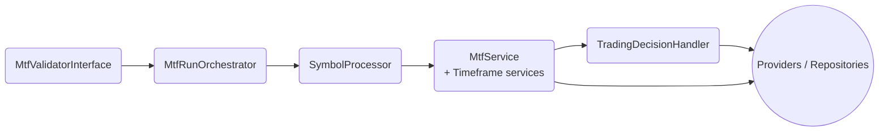

# Documentation - Système de Trading V3

## 📚 Vue d'ensemble

Cette documentation couvre l'ensemble du système de trading V3, avec un focus particulier sur le système de switch PHP/SQL pour les indicateurs techniques.

## 🏗️ Architecture

Depuis la refonte MTF 2024, le socle est explicitement découpé entre **Application** (orchestration) et **Infrastructure** (adaptateurs). Ce schéma décrit le flux principal :



- **Application** : façade `MtfValidatorInterface`, orchestrateur et pipeline de décisions.
- **Domain** : stratégies de validation (ex : High Conviction) et DTOs.
- **Infrastructure** : repositories Doctrine, clients BitMart, cache Redis/DB.

Les README spécifiques (ex. `src/MtfValidator/README_REFACTORED_ARCHITECTURE.md`) détaillent les responsabilités de chaque couche.

## 🧭 Flux décisionnel MTF

Le pipeline runtime suit trois étapes clefs :

1. **Façade** : `MtfRunService` expose l'interface `MtfValidatorInterface` et transforme les `MtfRunRequestDto` en DTO internes.
2. **Pipeline** : `MtfRunOrchestrator` séquence le verrouillage, la vérification des switches et l'évaluation des timeframes via `SymbolProcessor`.
3. **Décision** : `TradingDecisionHandler` applique les règles d'engagement et délègue à `TradeEntryService` (simulateur ou exécution réelle).

Les décisions sont journalisées dans les canaux `order_journey` et `positions_flow`, ce qui permet un suivi bout-en-bout (validation → ordre BitMart).

## 📖 Documentation disponible

### 🧠 MTF Validator (Contrats 2024)

#### [API Run contractuelle](./MTF_RUN_API.md)
Documentation des nouvelles options d'exécution (`lock_per_symbol`, `user_id`, `ip_address`) et du flux façade → pipeline → décisions.

#### [Checklist de migration](./MTF_MIGRATION_CHECKLIST.md)
Liste d'actions pour basculer les intégrations CLI/Temporal et mettre à jour les contrôles d'observabilité.

### 🎯 Système de Switch PHP/SQL

#### [Documentation principale](./INDICATOR_SWITCH_SYSTEM.md)
Documentation complète du système de switch PHP/SQL pour les indicateurs techniques.

**Contenu :**
- Architecture et composants
- Configuration et paramètres
- Modes de fonctionnement
- Utilisation et exemples
- Monitoring et performances
- Administration et maintenance

#### [Guide de migration](./MIGRATION_GUIDE_INDICATOR_SWITCH.md)
Guide étape par étape pour migrer vers le nouveau système de switch.

**Contenu :**
- Étapes de migration
- Mise à jour du code
- Tests de validation
- Points d'attention
- Plan de migration

#### [Référence API](./API_REFERENCE_INDICATOR_SWITCH.md)
Documentation détaillée de l'API du système de switch.

**Contenu :**
- Services et méthodes
- DTOs et types
- Commandes CLI
- Configuration
- Exemples d'utilisation

#### [Guide de dépannage](./TROUBLESHOOTING_INDICATOR_SWITCH.md)
Solutions aux problèmes courants du système de switch.

**Contenu :**
- Problèmes de configuration
- Erreurs de base de données
- Problèmes de performance
- Outils de diagnostic
- Support et contacts

### 📊 Indicateurs techniques

#### [Documentation des indicateurs](./README_INDICATEURS_TECHNIQUES.md)
Documentation des indicateurs techniques implémentés.

**Contenu :**
- Liste des indicateurs
- Formules et calculs
- Interprétation des signaux
- Exemples d'utilisation

#### [Système EMA](./README_EMA_SYSTEM.md)
Documentation spécifique du système EMA (Exponential Moving Average).

**Contenu :**
- Architecture du système EMA
- Fonctions SQL et agrégats
- Vues matérialisées
- Utilisation et exemples

## 🚀 Démarrage rapide

### 1. Installation

```bash
# Cloner le projet
git clone <repository-url>
cd tradingV3

# Démarrer les services
docker-compose up -d

# Exécuter les migrations
docker exec trading_app_php bin/console doctrine:migrations:migrate
```

### 2. Configuration

```yaml
# config/trading.yml
indicator_calculation:
    mode: sql                            # Mode par défaut
    fallback_to_php: true                # Fallback activé
    performance_threshold_ms: 100        # Seuil de performance
```

### 3. Test du système

```bash
# Test complet du système de switch
./scripts/test_indicator_modes.sh BTCUSDT 5m

# Test des performances
docker exec trading_app_php bin/console app:test-indicator-calculation BTCUSDT 5m
```

## 🧪 Tests et validation

### Scripts de test disponibles

| Script | Description | Usage |
|--------|-------------|-------|
| `test_indicator_modes.sh` | Test complet du système de switch | `./scripts/test_indicator_modes.sh BTCUSDT 5m` |
| `test_indicators.sh` | Test des vues matérialisées | `./scripts/test_indicators.sh` |
| `demo_indicators.sh` | Démonstration des indicateurs | `./scripts/demo_indicators.sh` |
| `refresh_indicators.sh` | Rafraîchissement des vues | `./scripts/refresh_indicators.sh` |

### Commandes de test

| Commande | Description | Usage |
|----------|-------------|-------|
| `app:test-indicator-calculation` | Test du système de switch | `bin/console app:test-indicator-calculation BTCUSDT 5m` |
| `app:indicator:status` | Statut du système | `bin/console app:indicator:status` |
| `app:indicator:performance-report` | Rapport de performance | `bin/console app:indicator:performance-report` |

## 📊 Monitoring

### Métriques disponibles

- **Performances** : Temps d'exécution par indicateur
- **Fiabilité** : Taux de succès/échec
- **Utilisation** : Répartition PHP/SQL
- **Erreurs** : Logs et alertes

### Dashboards

- **Interface web** : `/admin/indicators/calculation-mode`
- **Logs** : `var/log/prod.log`
- **Métriques** : Via les commandes CLI

## 🔧 Maintenance

### Tâches régulières

#### Quotidiennes
- [ ] Vérification des performances
- [ ] Surveillance des erreurs
- [ ] Rafraîchissement des vues matérialisées

#### Hebdomadaires
- [ ] Analyse des métriques
- [ ] Optimisation des index
- [ ] Nettoyage des logs

#### Mensuelles
- [ ] Mise à jour de la documentation
- [ ] Révision de la configuration
- [ ] Tests de régression

### Scripts de maintenance

```bash
# Rafraîchissement des vues
./scripts/refresh_indicators.sh

# Diagnostic complet
./scripts/diagnose_indicator_system.sh

# Monitoring des performances
./scripts/monitor_indicator_performance.sh
```

## 🚨 Support et dépannage

### Problèmes courants

1. **Service non trouvé** → Vider le cache Symfony
2. **Vues manquantes** → Exécuter les migrations
3. **Performances dégradées** → Optimiser les index
4. **Données incohérentes** → Rafraîchir les vues

### Escalade

1. **Niveau 1** : Documentation et scripts de diagnostic
2. **Niveau 2** : Équipe de développement
3. **Niveau 3** : Équipe DevOps

### Contacts

- **Équipe Backend** : backend@trading-v3.com
- **Équipe DevOps** : devops@trading-v3.com
- **Support Urgent** : support@trading-v3.com

## 📈 Roadmap

### Version 1.1 (Q1 2025)
- [ ] Cache Redis pour les résultats SQL
- [ ] Dashboard de monitoring avancé
- [ ] Métriques Prometheus
- [ ] Auto-scaling des seuils

### Version 1.2 (Q2 2025)
- [ ] Load balancing des calculs
- [ ] Intégration Grafana
- [ ] Alertes automatiques
- [ ] API REST complète

### Version 2.0 (Q3 2025)
- [ ] Machine Learning pour l'optimisation
- [ ] Calculs distribués
- [ ] Interface graphique avancée
- [ ] Intégration multi-brokers

## 📚 Ressources externes

### Documentation technique
- [PostgreSQL - Materialized Views](https://www.postgresql.org/docs/current/rules-materializedviews.html)
- [Symfony - Dependency Injection](https://symfony.com/doc/current/service_container.html)
- [Brick Math - BigDecimal](https://github.com/brick/math)

### Standards et bonnes pratiques
- [PSR-3 - Logger Interface](https://www.php-fig.org/psr/psr-3/)
- [PSR-4 - Autoloader](https://www.php-fig.org/psr/psr-4/)
- [Clean Architecture](https://blog.cleancoder.com/uncle-bob/2012/08/13/the-clean-architecture.html)

## 🤝 Contribution

### Comment contribuer

1. **Fork** le projet
2. **Créer** une branche feature
3. **Implémenter** les changements
4. **Tester** avec les scripts fournis
5. **Documenter** les modifications
6. **Soumettre** une pull request

### Standards de code

- **PSR-12** : Coding Standard
- **PHPStan** : Static Analysis
- **PHPUnit** : Tests unitaires
- **Documentation** : PHPDoc complète

### Processus de review

1. **Review automatique** : Tests et analyse statique
2. **Review manuel** : Équipe de développement
3. **Tests d'intégration** : Validation complète
4. **Déploiement** : Mise en production

---

**Version :** 1.0  
**Dernière mise à jour :** 2025-01-15  
**Auteur :** Équipe Trading V3  
**Licence :** Propriétaire
