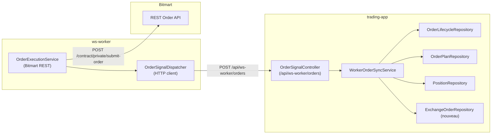

# Spécification technique  
# Synchronisation des ordres ws-worker → trading-app

## 1. Architecture cible

- `OrderExecutionService` continue d’appeler Bitmart.
- `OrderSignalDispatcher` encapsule le nouvel envoi REST vers `trading-app`, gère retries, journalisation, signature.
- `trading-app` expose un endpoint dédié, mappe la requête vers un service de domaine (`WorkerOrderSyncService`) qui fédère les updates Doctrine.
- Une nouvelle entité `ExchangeOrder` permet de tracer finement les ordres soumis (optionnel mais recommandé pour reporting).

## 2. API REST `trading-app`
### 2.1 Endpoints exposés
- **POST `/api/ws-worker/orders`** : réception d’un signal d’ordre depuis ws-worker (idempotent).
- **GET `/api/ws-worker/orders`** : consultation des derniers ordres (filtres `symbol`, `kind`, `limit`).
- **GET `/api/ws-worker/orders/{clientOrderId}`** : vue détaillée d’un ordre (exchange order, lifecycle, plan, position).
- **Auth**: entête `X-WS-Worker-Signature` (HMAC SHA256) + `X-WS-Worker-Timestamp`
- **Content-Type**: `application/json`

### 2.2 Payload POST attendu
```json
{
  "kind": "ENTRY",
  "status": "SUBMITTED",
  "order_id": "123456789",
  "client_order_id": "MTF_BTCUSDT_OPEN_20240320_ABC123",
  "parent_client_order_id": "MTF_BTCUSDT_OPEN_20240320_ABC123",
  "symbol": "BTCUSDT",
  "side": "buy_open_long",
  "type": "limit",
  "price": "57000.5",
  "size": "0.15",
  "leverage": "10",
  "plan": {
    "id": 987,
    "uuid": "9ab0b2ef-0d1d-4c2d-aa64-1c314c2386f0",
    "run_id": "d76c0935-1b65-4fd9-bb40-38dafa1ae66c"
  },
  "position": {
    "symbol": "BTCUSDT",
    "side": "LONG"
  },
  "context": {
    "entry_price": "56980.0",
    "stop_loss_price": "56200.0",
    "take_profit_price": "58200.0",
    "strategy": "MTF_PULSE",
    "timeframe": "15m",
    "risk_usd": "150.0",
    "source": "ws-worker"
  },
  "exchange_response": {
    "code": 0,
    "message": "OK",
    "data": { "...": "..." }
  },
  "submitted_at": "2024-03-20T12:34:56.123456Z",
  "retry_count": 0,
  "trace_id": "a5f94c4a-3f6a-4a90-9a5d-3d597899d741"
}
```
- `parent_client_order_id` est requis pour `STOP_LOSS` et `TAKE_PROFIT`.
- `order_id` peut être omis si Bitmart ne le retourne pas immédiatement (champ nullable).
- `exchange_response` conservé pour audit, taille maximale 4 KB → compresser/filtrer si nécessaire.

### 2.3 Réponses attendues
| Code | Corps | Usage |
|------|-------|-------|
| `202 Accepted` | `{"status":"accepted","order_lifecycle_id":1234,"exchange_order_id":456}` | Traitement asynchrone (par défaut) |
| `200 OK` | idem | Possible si traitement synchrone rapide |
| `400 Bad Request` | `{"status":"error","code":"plan_not_found","message":"..."} ` | Erreur validation définitive |
| `401 Unauthorized` | `{"status":"error","code":"auth_failed"}` | Signature invalide |
| `409 Conflict` | `{"status":"ignored","code":"duplicate","order_lifecycle_id":1234}` | Signal idempotent déjà traité |
| `500` / `503` | `{"status":"error","code":"internal","message":"..."} ` | À re-tenter côté worker |

### 2.4 Validation & idempotence
- Idempotence gérée par combinaison `(client_order_id, kind)` → unique constraint niveau BDD.
- Si `order_id` est fourni, il est aligné avec `client_order_id`; en cas de mismatch existant, journaliser puis retourner `409`.
- Validation JSON via `symfony/validator` + contraintes custom (side/type autorisés, taille numérique positive).

## 3. Authentification & sécurité
- Secret partagé `WS_WORKER_SHARED_SECRET`.
- Signature `HMAC_SHA256(secret, <timestamp>\n<body>)`.
- `X-WS-Worker-Timestamp` (Unix ms). Rejet si dérive > ±60 s.
- Endpoint uniquement accessible via réseau interne (NGINX rule) + TLS.
- Rate limiting (`max 50 req/min`) configurable via `symfony/limiter`.

## 4. Intégration `ws-worker`
### 4.1 Nouveaux composants
- `App\Service\Order\OrderSignalDispatcher` :  
  - dépendances : `HttpClientInterface`, config (`TRADER_BASE_URI`, `WS_WORKER_SECRET`), logger.  
  - méthodes : `dispatch(OrderSignal $signal): void`, `retryLater(OrderSignal $signal, BackoffState $state)`.
- `App\Service\Order\OrderSignalFactory` : conversion `Bitmart` → `OrderSignal` (DTO).
- `App\Service\Order\OrderExecutionService` : centralise soumission Bitmart + publication signal (remplacer code ad-hoc futur).
- `OrderSignal` DTO (immutable) contenant tous les champs listés §2.2.

### 4.2 Processus
1. `OrderExecutionService::submitEntry(OrderPlanContext $ctx)` :
   - appelle Bitmart,
   - construit `OrderSignal` (`kind=ENTRY`, `status` selon réponse),
   - appelle `OrderSignalDispatcher`.
2. `OrderSignalDispatcher` :
   - sérialise JSON (via `json_encode` strict),
   - calcule signature,
   - POST vers `/api/ws-worker/orders`,
   - gère réponses :
     - `2xx` → log succès,
     - `409` → log info, stop retries,
     - `4xx` → log erreur définitive (`sync_failed`), stop retries,
     - `5xx`/timeout → planifie retry (exponentiel : 0s, 5s, 15s, 45s, 120s) via boucle ReactPHP.
3. Persistences locales worker :
   - fichier JSON `var/order-sync-failures.jsonl` pour redémarrage.
   - sur restart, relecture du backlog et re-submission.

### 4.3 Configuration
```
TRADER_BASE_URI=https://trader.internal
TRADER_ORDER_SIGNAL_PATH=/api/ws-worker/orders
TRADER_SECRET=...
TRADER_TIMEOUT_SECONDS=2.0
TRADER_MAX_RETRIES=5
```
- Ajouter au `.env`, `config/services.yaml` injection auto.

## 5. Intégration `trading-app`
### 5.1 Controller
`App\Controller\Api\OrderSignalController` :
- Route `/api/ws-worker/orders`.
- Vérifie signature + timestamp.
- Valide DTO (`OrderSignalRequest`).
- Transmet au service `WorkerOrderSyncService`.
- Retourne `202` + identifiants.

### 5.2 Service de synchronisation
`App\Domain\Trading\Order\WorkerOrderSyncService` :
1. Démarre une transaction Doctrine.
2. Résout/charge les entités :
   - `OrderPlan` via `plan.id` ou `uuid`; si absent et `kind=ENTRY`, lancer `PlanNotFoundException`.
   - `OrderLifecycle` :
     - `findOneByOrderId` si `order_id` fourni,
     - sinon `findOneByClientOrderId` (nouvelle méthode).
     - crée si inexistant (`new OrderLifecycle(...)`), renseigne `kind`, `status`.
   - `ExchangeOrder` (cf. §6) : idem, alimente `status`, `kind`, `payload`.
3. Met à jour `OrderPlan` :
   - `status` :  
     - `ENTRY` + `SUBMITTED` → `EXECUTED`,  
     - `ENTRY` + `REJECTED` → `FAILED` (ou `PENDING_RETRY` si `context.retryable=true`).  
   - `execJson` : fusion `{order_id, client_order_id, submitted_at, price, size, side}`.
   - `contextJson` enrichi si nouveaux champs.
4. Met à jour `Position` :
   - `findOneBySymbolSide`.
   - Si absent → `new Position`.
   - `payload['expected_entry']` = `{client_order_id, kind, price, size, leverage, submitted_at}`.
   - `status` reste `OPEN`/`CLOSED` selon `size` actuelle (pas de modification si non pertinente).
5. Persiste & flush.
6. Publie éventuelle notification (EventDispatcher) pour instrumentation (`OrderSignalReceivedEvent`).

Gestion erreur :
- Toute exception déclenche rollback + réponse `500`.
- Si duplication (`UniqueConstraintViolationException`) → renvoyer `409`.

## 6. Schéma de données & migrations
### 6.1 Nouvelle entité `ExchangeOrder`
Table `exchange_order` :
| Champ | Type | Contraintes |
|-------|------|-------------|
| `id` | bigint PK | auto incrément |
| `order_id` | string(80) | nullable, index |
| `client_order_id` | string(80) | unique |
| `parent_client_order_id` | string(80) | index |
| `symbol` | string(50) | index |
| `kind` | string(20) | index |
| `status` | string(24) | |
| `side` | string(16) | |
| `type` | string(24) | |
| `price` | numeric(24,12) | nullable |
| `size` | numeric(28,12) | nullable |
| `leverage` | int | nullable |
| `plan_id` | bigint | FK `order_plan.id` nullable |
| `position_id` | bigint | FK `positions.id` nullable |
| `submitted_at` | timestamptz | |
| `exchange_payload` | jsonb | default '{}' |
| `metadata` | jsonb | default '{}' |
| `created_at` / `updated_at` | timestamptz | |

Objectif : requêtes analytiques rapides et simplification du mapping (optionnel mais recommandé).  
Indexer `(client_order_id, kind)`, `(order_id)`.

### 6.2 Modifications entités existantes
- `order_lifecycle` : ajouter colonne `kind` (`string(20)`), indexer `(symbol, kind)`. Exposer getter/setter.
- `order_plan` :  
  - champ `submitted_at` (`timestamptz` nullable) si besoin de reporting.  
  - sinon stocker dans `exec_json`.
- `positions` : pas de nouvelle colonne ; enrichissement `payload`.

### 6.3 Doctrine / migrations
- Générer migration Doctrine pour `ExchangeOrder` + colonnes ajoutées.
- Mettre à jour repositories :
  - `OrderLifecycleRepository::findOneByClientOrderId`.
  - `ExchangeOrderRepository` (CRUD simple, `findOneByClientId`).

## 7. Gestion des retries & workflows
- `ws-worker` :  
  - Maintenir `retry_count` dans `OrderSignal`.  
  - Lors retry, `submitted_at` reste l’horodatage initial.  
  - Si max retries atteint, enregistrer dans un log dédié + alerte (hook Prometheus/Grafana).
- `trading-app` :  
  - Réponses `409` pour idempotence ; aucune action supplémentaire (c’est au worker d’arrêter).
  - Possibilité de déclencher une alerte via `OrderSignalFailedEvent`.

## 8. Observabilité & logs
- `ws-worker` :
  - Logger `order.signal.sent` avec `trace_id`, `client_order_id`, `kind`, `status`, `latency_ms`.
  - Logger `order.signal.retry` avec `attempt`, `next_delay`.
- `trading-app` :
  - Logger `order.signal.received` (niveau INFO).
  - Logger `order.signal.validated` (DEBUG) + dumps limités.
  - Logger `order.signal.persisted` (INFO) avec IDs.
  - Exposer métriques Prometheus :  
    - Counter `order_signal_total{kind,status}`  
    - Histogram `order_signal_process_seconds`

## 9. Tests & QA
- **Unit tests worker** :  
  - `OrderSignalFactoryTest` (mapping).  
  - `OrderSignalDispatcherTest` (signature, retry policy via HTTPlug mock).
- **Unit tests trader** :  
  - `OrderSignalRequestValidatorTest`.  
  - `WorkerOrderSyncServiceTest` (scénarios: entry success, protection success, rejection).  
  - `ExchangeOrderRepositoryTest`.
- **Tests d’intégration** :  
  - `OrderSignalControllerTest` (HTTP, signature).  
  - `ProcessOrderSignalCommandTest` (si traitement asynchrone).
- **Tests end-to-end** (docker-compose) :  
  - Simuler `ws-worker` → `trading-app` + capture BDD.

## 10. Déploiement & migration
1. Déployer `trading-app` avec migrations Doctrine.
2. Déployer `ws-worker` avec feature flag `ORDER_SIGNAL_SYNC_ENABLED=false`.
3. Tester endpoint manuellement (curl signé).
4. Activer flag en production, surveiller métriques.
5. Mettre en place alerte Grafana sur `order_signal_failed_total`.

## 11. Points ouverts
- Choix final du namespace pour `ExchangeOrder` (Domain vs Infrastructure).
- Gestion d’un backlog complet en cas de downtime prolongé (> 10 min) : prévoir queue persistante (Redis/SQLite) ?.
- Publication éventuelle dans Kafka pour d’autres consommateurs (non prévu court terme).
- Propagation du `trace_id` jusqu’aux logs de Bitmart (si API supporte `client_req_id`).

## Implémentation (journal)
- **Étape 1** – Cartographie du flux et validation des prérequis côté worker / backend.
- **Étape 2** – Implémentation du dispatcher HTTP (`OrderSignalDispatcher`) avec HMAC, backoff et journal des échecs ; intégration dans `WsWorkerCommand` et `OrderWorker`.
- **Étape 3** – Ajout du contrôleur `OrderSignalController`, du service `WorkerOrderSyncService`, de l’entité `ExchangeOrder` et des nouvelles méthodes repository (`findOneByClientOrderId`).
- **Étape 4** – Écriture des tests unitaires de synchronisation et actualisation des README / docs d’environnement (`TRADING_APP_*`, `WS_WORKER_SHARED_SECRET`).
